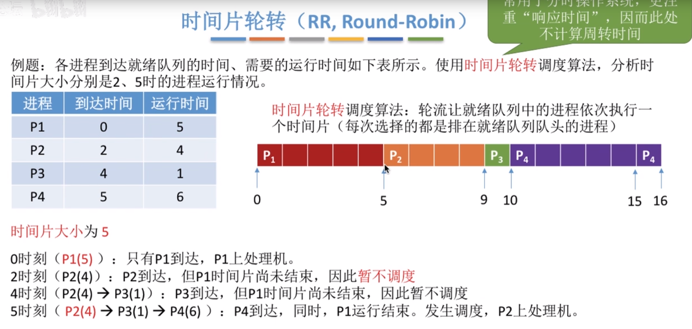
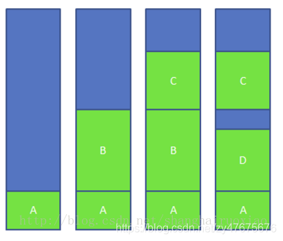
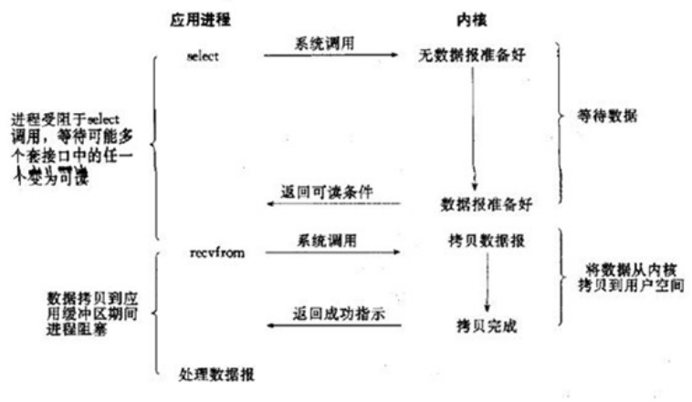

# 一、进程、线程

## Q:处理器的调度算法？

当就绪状态进程个数大于处理器数时，就必须依照某种策略来决定哪些进程优先占用处理器。

 **1.先来先服务算法FCFS**

很简单，跟日常排队一样，谁先排队谁先被服务


**2.短作业优先SJF（short job firdt）**

作业时间越短，优先级越高

注意：这里的作业时间，**必须是当前已到达且运行时间最短**，如果未到达的作业是不行的。

默认是非枪战版本。


也有抢占式的。

抢占式算法调度的时机有2个：

1.当有新的进程加入就绪队列中来

2.当一个进程完成时

当使用的是枪战式算法时，某一个进程可能是断断续续的执行。


**3.高响应比优先HRRN**

另外2种方法思考：


其实很简单，就是判断任务的**“性价比”**

**例子：**


总结：


**4.三种方法比较：**


这三种方法的交互性较低，不区分任务的紧急程度，所以三种算法适用于早期的批处理系统。

**不适用于交互式系统。**

交互式的有：


**5.时间片轮转调度RR（round robin）**

 该算法不注重等待时间等等，而是它的“响应时间”。


注意：若进程运行时间 《  时间片时间，则运**行完毕之后，进程主动放弃CPU。此时将进行进程调度。**

其次，**默认来说，新加进来的进程排在就绪队列前面。**



发现，这个和先来先服务一样的效果。

**结论：时间片不能太哒，否则会增加进程响应时间；时间片也不能太小，否称调度切换太频繁，系统开销更大**


方法总结：


注意：时间片轮转算法只适用于进程调度（低级调度），不适用作业调度（高级调度）


## Q: 进程、线程、协程之间的关系区别？


- **进程是对运行时程序的封装，是系统进行资源调度和分配的的基本单位，实现了操作系统的并发；**
- **线程是进程的子任务**，**是CPU调度和分派的基本单位**，用于保证程序的实时性，实现进程内部的并发；
- **线程是操作系统可识别的最小执行和调度单位**。每个线程都独自占用一个虚拟处理器：独自的寄存器组，指令计数器和处理器状态。每个线程完成不同的任务，但是**共享同一地址空间（也就是同样的动态内存，映射文件，目标代码等等）**，打开的文件队列和其他内核资源。

## Q: 请问进程间怎么通信？

**IPC：Inter-Process Communication，进程间通信**

### 1.本地进程通信

- #### 管道Pipe：


管道，通常指无名管道，是 UNIX 系统IPC最古老的形式。

**1、特点：**

1. 它是**半双工**的（即数据只能在一个方向上流动），具有固定的读端和写端。
2. 它只能用于具有  **亲缘关系的进程之间**  的通信（也是父子进程或者兄弟进程之间）。
3. 它可以看成是一种特殊的文件，对于它的读写也可以使用普通的read、write 等函数。但是它不是普通的文件，并不属于其他任何文件系统，并且只存在于内存中。

**2、原型：**

fd是文件描述符，一切接文件

```cpp
1 #include <unistd.h>
2 int pipe(int fd[2]);    // 返回值：若成功返回0，失败返回-1
```

当一个管道建立时，它会创建两个文件描述符：**`fd[0]`为读而打开，`fd[1]`为写而打开**。如下图：


要关闭管道只需将这两个文件描述符关闭即可

**3、例子**

单个进程中的管道几乎没有任何用处。所以，**通常调用 pipe 的进程接着调用 fork**，这样就创建了**父进程与子进程之间的 IPC 通道。**如下图所示：

- 因为fork之后会产生一个子进程，变量会拷贝一份到进程资源中，所以相当于共享了管道。


```cpp
#include<stdio.h>
#include<unistd.h>

int main()
{
    int fd[2];  // 两个文件描述符
    pid_t pid;
    char buff[20]; //缓冲区

    if(pipe(fd) < 0)  // 创建管道
        printf("Create Pipe Error!\n");
    
	/*******创建pipe之后，开始fork出子进程********/
    if((pid = fork()) < 0)  // 创建子进程
        printf("Fork Error!\n");
    else if(pid > 0)  // 父进程
    {
        close(fd[0]); // 关闭读端
        write(fd[1], "hello world\n", 12); //写入数据
    }
    else  //子进程
    {
        close(fd[1]); // 关闭写端
        read(fd[0], buff, 20);    //读数据到buffer
        printf("%s", buff);
    }

    return 0;
}
```

- #### FIFO：


FIFO，也称为命名管道，它是一种文件类型。

**1、特点**

1. FIFO可以在   **无关的进程**   之间交换数据，与无名管道不同。
2. FIFO有路径名与之相关联，它以一种特殊设备文件形式存在于文件系统中。

**2、原型**

```cpp
1 #include <sys/stat.h>
2 // 返回值：成功返回0，出错返回-1
3 int mkfifo(const char *pathname, mode_t mode);
```

一旦创建了一个 FIFO，就可以用一般的文件I/O函数操作它。

当 open 一个FIFO时，是否设置非阻塞标志（`O_NONBLOCK`）的区别：

- 若**没有指定`O_NONBLOCK`（默认）**，阻塞。只读 open 要阻塞到某个其他进程为写而打开此 FIFO。类似的，只写 open 要阻塞到某个其他进程为读而打开它。
- 若指定了`O_NONBLOCK`，则只读 open 立即返回。而只写 open 将出错返回 -1 如果没有进程已经为读而打开该 FIFO，其errno置ENXIO。

**3、例子**

FIFO的通信方式类似于在**进程中使用文件来传输数据**，只不过FIFO类型文件同时具有管道的特性。在数据读出时，FIFO管道中同时清除数据，并且“先进先出”。下面的例子演示了使用 FIFO 进行 IPC 的过程：


- #### 消息队列


消息队列，是消息的链接表，存放在内核中。一个消息队列由一个标识符（即队列ID）来标识。

**1、特点**

1. 消息队列是   **面向记录**的，其中的消息具有   **特定的格式以及特定的优先级**。
2. **消息队列独立于发送与接收进程**。进程终止时，消息队列及其内容并不会被删除。
3. 消息队列可以实现消息的**随机查询**,消息不一定要以先进先出的次序读取,也可以按消息的类型读取。

**2、原型**

```cpp
#include <sys/msg.h>
// 创建或打开消息队列：成功返回队列ID，失败返回-1
int msgget(key_t key, int flag);
// 添加消息：成功返回0，失败返回-1
int msgsnd(int msqid, const void *ptr, size_t size, int flag);
// 读取消息：成功返回消息数据的长度，失败返回-1
int msgrcv(int msqid, void *ptr, size_t size, long type,int flag);
// 控制消息队列：成功返回0，失败返回-1
int msgctl(int msqid, int cmd, struct msqid_ds *buf);
```

- #### 信号量


信号量（semaphore）与已经介绍过的 IPC 结构不同，**它是一个计数器**。信号量用于实现进程间的互斥与同步，而不是用于存储进程间通信数据。

**1、特点**

1. 信号量用于进程间同步，若要在**进程间传递数据需要结合共享内存**。

2. 信号量基于操作系统的 PV 操作，程序对信号量的操作都是原子操作。

3. 每次对信号量的 PV 操作不仅限于对信号量值加 1 或减 1，而且可以加减任意正整数。

4. 支持信号量组。\

   

- #### 共享内存


共享内存（Shared Memory），指两个或多个进程**共享一个给定的存储区**。

**1、特点**

1. **共享内存是最快的一种 IPC**，因为进程是直接对内存进行存取。
2. 因为多个进程可以同时操作，所以**需要进行同步**。
3. **信号量+共享内存**通常结合在一起使用，信号量用来同步对共享内存的访问。

#### 五种通讯方式总结

1.管道：**速度慢**，容量有限，只有**父子进程**能通讯   

2.FIFO：**任何进程间都能通讯，但速度慢**   

3.消息队列：容量受到系统限制，且要注意第一次读的时候，要考虑上一次没有读完数据的问题   

4.信号量：不能传递**复杂消息**，只能用来**同步**   

5.共享内存区：**能够很容易控制容量，速度快，但要保持同步**，比如一个进程在写的时候，另一个进程要注意读写的问题，相当于线程中的线程安全，当然，共享内存区同样可以用作线程间通讯，不过没这个必要，线程间本来就已经共享了同一进程内的一块内存


### 2.网络间进程通信

#### 套接字SOCKET：

socket也是一种进程间通信机制，与其他通信机制不同的是，**它可用于不同主机之间的进程通信。**


## Q: 请你说一说线程之间的通信方式？

**1、临界区：**

通过多线程的串行化来访问公共资源或一段代码，速度快，适合控制数据访问；

**2、互斥量 Synchronized/Lock：**

采用互斥对象机制，只有拥有互斥对象的线程才有访问公共资源的权限。因为互斥对象只有一个，所以可以保证公共资源不会被多个线程同时访问

**3、信号量 Semphare：**

为控制具有有限数量的用户资源而设计的，它允许多个线程在同一时刻去访问同一个资源，但一般需要限制同一时刻访问此资源的最大线程数目。

**4、事件(信号)，Wait/Notify(这就是条件锁)：**

通过通知操作的方式来保持多线程同步，还可以方便的实现多线程优先级的比较操作。


## Q: 请你说一下linux线程同步的几种方式

线程的最大特点是**资源的共享性**，但资源共享中的同步问题是多线程编程的难点。linux下提供了多种方式来处理线程同步，最常用的**是互斥锁、条件变量和信号量。**

### 一、互斥锁(mutex)

通过锁机制实现线程间的同步。

1. 初始化锁。在Linux下，线程的互斥量数据类型是  **pthread_mutex_t**  。在使用前,要对它进行初始化。
   静态分配：pthread_mutex_t mutex = PTHREAD_MUTEX_INITIALIZER;
   动态分配：int **pthread_mutex_init**(pthread_mutex_t *mutex, const pthread_mutex_attr_t *mutexattr);

​    2.加锁。对共享资源的访问，要对互斥量进行加锁，如果互斥量已经上了锁，调用线程会阻塞，直到互斥量被解锁。

​	int **pthread_mutex_lock**(pthread_mutex *mutex);
​	int **pthread_mutex_trylock**(pthread_mutex_t *mutex);

​	3.解锁。在完成了对共享资源的访问后，要对互斥量进行解锁。
​	int **pthread_mutex_unlock**(pthread_mutex_t *mutex);

​	4.销毁锁。锁在是使用完成后，需要进行销毁以释放资源。
​	int **pthread_mutex_destroy**(pthread_mutex *mutex);

### 二、条件变量(cond)

​	与互斥锁不同，**条件变量是用来等待**而不是用来上锁的。条件变量用来自动阻塞一个线程，直到某特殊情况发生为止。

​	条件变量分为两部分: **条件和变量**。**条件本身是由互斥量保护的。线程在改变条件状态前先要锁住互斥量。**

​	条件变量是利用   **线程间共享的全局变量**  进行同步的一种机制，主要包括两个动作：一个线程等待"条件变量的条件成立"而挂起；另一个线程使"条件成立"（给出条件成立信号）。

​	**条件的检测是在互斥锁的保护下进行的。**如果一个条件为假，一个线程自动阻塞，并释放等待状态改变的互斥锁。如果另一个线程改变了条件，它发信号给关联的条件变量，唤醒一个或多个等待它的线程，重新获得互斥锁，重新评价条件。

​	**操作：**

1. 初始化条件变量。
   静态态初始化，pthread_cond_t cond = PTHREAD_COND_INITIALIER;
   动态初始化，int **pthread_cond_init**(pthread_cond_t *cond, pthread_condattr_t *cond_attr);
2. 等待条件成立。**释放锁,同时阻塞等待条件变量为真才行**。timewait()设置等待时间,仍未signal,返回ETIMEOUT(加锁保证只有一个线程wait)
   int **pthread_cond_wait**(pthread_cond_t *cond, pthread_mutex_t *mutex);
   int **pthread_cond_timewait**(pthread_cond_t *cond,pthread_mutex *mutex,const timespec *abstime);
3. 激活条件变量。pthread_cond_signal,pthread_cond_broadcast（激活所有等待线程）
   int **pthread_cond_signal**(pthread_cond_t *cond);
   int **pthread_cond_broadcast**(pthread_cond_t *cond); //解除所有线程的阻塞
4. 清除条件变量。无线程等待,否则返回EBUSY
   int **pthread_cond_destroy**(pthread_cond_t *cond);


**pthread_cond_wait**函数，这里注意：

- 调用pthread_cond_wait**前**需要**先对互斥量mutex上锁**，才能把&mutex传入pthread_cond_wait函数
- **在pthread_cond_wait函数内部，会首先对传入的mutex解锁**
- 当等待的条件到来后，**pthread_cond_wait函数内部在返回前会去锁住传入的mutex**

```cpp
#include <stdio.h>
#include <pthread.h>
#include "stdlib.h"
#include "unistd.h"
pthread_mutex_t mutex; //互斥锁
pthread_cond_t cond; //条件变量
void hander(void *arg)
{
	free(arg);
	(void)pthread_mutex_unlock(&mutex);
}
void *thread1(void *arg)
{
	pthread_cleanup_push(hander, &mutex);
	while(1)
	{
		printf("thread1 is running\n");
		pthread_mutex_lock(&mutex);              //先锁上
		pthread_cond_wait(&cond, &mutex);        //等待cond成真，并释放锁
		printf("thread1 applied the condition\n");//条件成真，处理数据，并上锁
		pthread_mutex_unlock(&mutex);             //解锁
		sleep(4);
	}
	pthread_cleanup_pop(0);
}
void *thread2(void *arg)
{
	while(1)
	{
		printf("thread2 is running\n");
		pthread_mutex_lock(&mutex);              //先锁上
		pthread_cond_wait(&cond, &mutex);         //等待cond成真，并释放锁
		printf("thread2 applied the condition\n");//条件成真，处理数据，并上锁
		pthread_mutex_unlock(&mutex);            //解锁
		sleep(1);
	}
}
int main()
{
	pthread_t thid1,thid2;  //生成2个线程
	printf("condition variable study!\n");
	pthread_mutex_init(&mutex, NULL);
	pthread_cond_init(&cond, NULL); //初始化互斥锁和条件变量
	pthread_create(&thid1, NULL, thread1, NULL);
	pthread_create(&thid2, NULL, thread2, NULL); //给多线程传入入口函数，开始执行
	sleep(1);
    
	do
	{
		pthread_cond_signal(&cond);  //条件成真，激活线程
	}while(1);
	sleep(20);
	pthread_exit(0);
	return 0;
}
```


### 三、信号量(sem)

​	如同进程一样，**线程也可以通过信号量来实现通信**，虽然是轻量级的。信号量函数的名字都以"sem_"打头。线程使用的基本信号量函数有四个。

**操作：**

1. 信号量初始化。
   int **sem_init** (sem_t *sem , int pshared, unsigned int value);
   这是对由sem指定的信号量进行初始化，设置好它的共享选项(linux 只支持为0，即表示它是当前进程的局部信号量)，然后给它一个初始值VALUE。
2. 等待信号量，**V操作**。**给信号量减1**，然后**等待直到信号量的值大于0**。
   int **sem_wait**(sem_t *sem);
3. 释放信号量，**P操作**。**信号量值加1。并通知其他等待线程**。
   int **sem_post**(sem_t *sem);
4. 销毁信号量。我们用完信号量后都它进行清理。归还占有的一切资源。
   int **sem_destroy**(sem_t *sem);


## Q: 你说一下各种进程：孤儿进程、僵尸进程？

### 1）正常进程

正常情况下，子进程是通过父进程创建的，子进程再创建新的进程。子进程的结束和父进程的运行是一个异步过程，即父进程永远无法预测子进程到底什么时候结束**。 当一个进程完成它的工作终止之后，它的父进程需要调用wait()或者waitpid()系统调用取得子进程的终止状态。**

**unix**提供了一种机制可以保证只要父进程想知道子进程结束时的状态信息， 就可以得到：在每个进程退出的时候，内核释放该进程所有的资源，包括打开的文件，占用的内存等。 但是**仍然为其保留一定的信息，直到父进程通过wait / waitpid来取时才释放。**

保存信息包括：

- 1进程号the process ID
- 2退出状态the termination status of the process
- 3运行时间the amount of CPU time taken by the process等

### 2）孤儿进程

将被init进程收养。

一个父进程退出，而它的一个或多个子进程还在运行，那么那些子进程将成为孤儿进程。**孤儿进程将被init进程(进程号为1)所收养，并由init进程对它们完成状态收集工作。**

### 3）僵尸进程

一个进程使用fork创建子进程，如果子进程退出，而**父进程并没有调用wait或waitpid获取子进程的状态信息**，那么子进程的进程描述符仍然保存在系统中。这种进程称之为**僵尸进程。**

- **僵尸进程是一个进程必然会经过的过程：这是每个子进程在结束时都要经过的阶段。**

如果子进程在exit()之后，父进程没有来得及处理，这时用ps命令就能看到子进程的状态是“Z”。如果父进程能及时 处理，可能用ps命令就来不及看到子进程的僵尸状态，但这并不等于子进程不经过僵尸状态。

如果父进程在子进程结束之前退出，则子进程将由init接管。init将会以父进程的身份对僵尸状态的子进程进行处理。

**危害：**

​	如果进程不调用wait / waitpid的话， 那么保留的那段信息就不会释放，**其进程号就会一直被占用，但是系统所能使用的进程号是有限的**，如果大量的产生僵死进程，将因为没有可用的进程号而导致系统不能产生新的进程。

**外部消灭**：

​	通过kill发送**SIGTERM**或者**SIGKILL**信号**消灭产生僵尸进程的进程**，**也就是杀死它的爸爸**，**它产生的僵死进程就变成了孤儿进程**，这些孤儿进程会被init进程接管，init进程会wait()这些孤儿进程，释放它们占用的系统进程表中的资源

**内部解决**：

​	1、**子进程退出时向父进程发送SIGCHILD信号，父进程处理SIGCHILD信号。**在信号处理函数中调用wait进行处理僵尸进程。

​	2、**fork两次**，**相当于变成孙进程了，我是你的爷爷不是你的爸爸，**这样你就是孤儿进程了，自动被init进程收养。


## Q:一个进程可以最多创建多少线程？


## Q: 进程之间互相影响吗？线程呢？

**进程之间互不影响**，同一进程下的线程之间互相影响，一个线程挂了，可能导致系统崩溃。

不过如果两个进程之间是有血缘关系的话，此时如果父进程挂了，子进程就会变成孤儿进程，将会被init进程收养；

如果儿子进程挂了，且父进程没有处理SIGCHILD信号，那么就会变成僵尸进程。


## Q: 请你说一说有了进程，为什么还要有线程？

多进程实现多程序并发执行，但是进程只能做一件事情。

为了能让进程并发执行多件事情，引入线程。

**线程的优势：**

- ​	从资源上来讲，线程是一种非常"节俭"的多任务操作方式。在linux系统下，启动一个新的进程必须分配给它独立的地址空间，建立众多的数据表来维护它的代码段、堆栈段和数据段，这是一种"昂贵"的多任务工作方式。
- ​	从切换效率上来讲，运行于一个进程中的**多个线程，它们之间使用相同的地址空间**，而且线程间彼此切换所需时间也远远小于进程间切换所需要的时间。据统计，一个进程的开销大约是一个线程开销的30倍左右。
- ​	从通信机制上来讲，线程间方便的通信机制。对不同进程来说，它们具有独立的数据空间，要进行数据的传递只能通过进程间通信的方式进行，这种方式不仅费时，而且很不方便。**线程则不然，由于同一进城下的线程之间共享数据空间**，所以一个线程的数据可以直接为其他线程所用，这不仅快捷，而且方便。

除以上优点外，多线程程序作为一种多任务、并发的工作方式，还有如下优点：

​	1、使多CPU系统更加有效。**操作系统会保证当线程数不大于CPU数目时，不同的线程运行于不同的CPU上。（真正的并行！！）**

​	2、改善程序结构。一个既长又复杂的进程可以考虑分为多个线程，成为几个独立或半独立的运行部分，这样的程序才会利于理解和修改。


 

## Q: 请你介绍一下线程池？

### 1、为什么要线程池？

这里借用《Java 并发编程的艺术》提到的来说一下**使用线程池的好处**：

- **降低资源消耗**。通过重复利用已创建的线程降低线程创建和销毁造成的消耗。
- **提高响应速度**。当任务到达时，任务可以不需要的等到线程创建就能立即执行。
- **提高线程的可管理性**。线程是稀缺资源，如果无限制的创建，不仅会消耗系统资源，还会降低系统的稳定性，使用线程池可以进行统一的分配，调优和监控。

### **2、线程池原理**

预先创建预定数量的线程，将**多个任务加入到任务队列**。类似于生产者消费者，**多个线程相当于消费者，一个任务队列充当生产者**。当任务队列被塞入任务时，线程们就去竞争这些任务，但每次只有一个线程能够得到任务，该任务执行完成后，线程可以释放出来去承接下一个任务，这样保证多个任务可以并发地执行。


### 3、C++实现线程池？

设置一个生产者消费者队列，作为临界资源

### 4、实现注意细节

- 任务调度需要**加锁和互斥**
- 每次**添加一个新的任务就唤醒一个！！！线程，所以用notify_one,而不是notify_all**
- 线程池析构时**先唤醒所有线程**，然后**终止线程回收资源**，这个也是的。

上述三个实现细节，在lamost的线程池实现中，也是如此，在stop函数调用的时候，需要notify_all唤醒所有线程，然后挨个join进来，直到任务完成即可回收资源。


## Q: 你都使用什么线程模型？

常用线程模型

### 1、Future模型

该模型通常在使用的时候需要结合Callable接口配合使用。

Future是把结果放在将来获取，当前主线程并不急于获取处理结果。允许子线程先进行处理一段时间，处理结束之后就把结果保存下来，当主线程需要使用的时候再向子线程索取。

Callable是类似于Runnable的接口，其中call方法类似于run方法，所不同的是run方法不能抛出受检异常没有返回值，而call方法则可以抛出受检异常并可设置返回值。两者的方法体都是线程执行体。

### 2、fork&join模型（分治法）

该模型包含递归思想和回溯思想，递归用来拆分任务，回溯用合并结果。可以用来处理一些可以进行拆分的大任务。其主要是把一个大任务逐级拆分为多个子任务，然后分别在子线程中执行，当每个子线程执行结束之后逐级回溯，返回结果进行汇总合并，最终得出想要的结果。

这里模拟一个摘苹果的场景：有100棵苹果树，每棵苹果树有10个苹果，现在要把他们摘下来。为了节约时间，规定每个线程最多只能摘10棵苹树以便于节约时间。各个线程摘完之后汇总计算总苹果树。

### 3、actor模型

actor模型属于一种基于消息传递机制并行任务处理思想，它以消息的形式来进行线程间数据传输，避免了全局变量的使用，进而避免了数据同步错误的隐患。actor在接受到消息之后可以自己进行处理，也可以继续传递（分发）给其它actor进行处理。在使用actor模型的时候需要使用第三方Akka提供的框架。

### 4、生产者消费者模型（lamost里面用了）

生产者消费者模型都比较熟悉，**其核心是使用一个缓存来保存任务**。开启一个/多个线程来生产任务，然后再开启一个/多个来从缓存中取出任务进行处理。这样的好处是任务的生成和处理分隔开，生产者不需要处理任务，只负责向生成任务然后保存到缓存。而消费者只需要从缓存中取出任务进行处理。使用的时候可以根据任务的生成情况和处理情况开启不同的线程来处理。比如，生成的任务速度较快，那么就可以灵活的多开启几个消费者线程进行处理，这样就可以避免任务的处理响应缓慢的问题。

### 5、master-worker模型

master-worker模型类似于**任务分发策略**，开启一个master线程接收任务，然后在master中根据任务的具体情况进行分发给其它worker子线程，然后由子线程处理任务。如需返回结果，则worker处理结束之后把处理结果返回给master。


## Q：请介绍一下操作系统中的中断？

### 中断定义：	

中断是指CPU对系统发生的某个事件做出的一种反应，CPU暂停正在执行的程序，**保存现场后自动去执行相应的处理程序**，处理完该事件后再返回中断处继续执行原来的程序。

### 中断分类：

- 外中断：是由**CPU外部**引起的，如I/O中断、时钟中断
- 内中断：**CPU内部事件或程序执行中引起的中断**，例如程序非法操作，地址越界、浮点溢出）
- 系统调用：从用户态转变位内核态

### 中断处理：

中断处理一般分为中断响应和中断处理两个步骤，中断响应由硬件实施，中断处理主要由软件实施。


## Q: 请你说一说系统调用，自己用过哪些系统调用？

### 1）概念：

​	在计算机中，系统调用（英语：system call），又称为系统呼叫，指**运行在用户空间的程序向操作系统内核请求需要更高权限运行的服务。**系统调用提供了用户程序与操作系统之间的接口（**即系统调用是用户程序和内核交互的接口**）。

​	操作系统中的状态分为**管态（核心态）和目态（用户态）**。大多数系统交互式操作需求在内核态执行。如设备IO操作或者进程间通信。

​	**特权指令：一类只能在核心态下运行而不能在用户态下运行的特殊指令。**不同的操作系统特权指令会有所差异，但是一般来说主要是和硬件相关的一些指令。用户程序只在用户态下运行，有时需要访问系统核心功能，这时通过系统调用接口使用系统调用。

​	应用程序有时会需要一些危险的、权限很高的指令，如果把这些权限放心地交给用户程序是很危险的(比如一个进程可能修改另一个进程的内存区，导致其不能运行)，但是又不能完全不给这些权限。**于是有了系统调用，危险的指令被包装成系统调用，用户程序只能调用而无权自己运行那些危险的指令。**另外，计算机硬件的资源是有限的，为了更好的管理这些资源，所有的资源都由操作系统控制，进程只能向操作系统请求这些资源。操作系统是这些资源的唯一入口，这个入口就是系统调用。

### 2）系统调用举例：

对文件进行写操作，程序向打开的文件写入字符串“hello world”，open和write都是系统调用。如下：

```cpp
#include<stdio.h>
#include<stdlib.h>
#include<string.h>
#include<errno.h>
#include<unistd.h>
#include<sys/types.h>
#include<sys/stat.h>
#include<fcntl.h>
int main(int argc, char *argv[])
{
    if (argc<2)
        return 0;
    //用读写追加方式打开一个已经存在的文件
    int fd = open(argv[1], O_RDWR | O_APPEND); //打开文件open，系统调用
    if (fd == -1)
    {
        printf("error is %s\n", strerror(errno));
    }
    else
    {
        //打印文件描述符号
        printf("success fd = %d\n", fd);
        char buf[100];
        memset(buf, 0, sizeof(buf));
        strcpy(buf, "hello world\n");
        write(fd, buf, strlen(buf));   //写文件write，系统调用
        close(fd);
    }
    return 0;
}
```

还有写数据write，创建进程fork，vfork等都是系统调用。


## Q: 请你来说一说用户态到内核态的转化原理？

### 1）用户态切换到内核态的3种方式

1、系统调用

这是**用户进程主动要求切换到内核态**的一种方式，用户进程通过系统调用申请操作系统提供的服务程序完成工作。而系统调用的机制其核心还是使用了操作系统为用户特别开放的一个**中断**来实现，例如**Linux的int 80h中断**。

2、异常

当CPU在执行运行在用户态的程序时，**发现了某些事件不可知的异常**，这是会触发由当前运行进程切换到处理此。异常的内核相关程序中，也就到了内核态，比如  **缺页异常**。

3、外围设备的中断

当外围设备完成用户请求的操作之后，会向CPU发出相应的中断信号，这时CPU会暂停执行下一条将要执行的指令，转而去执行中断信号的处理程序，如果先执行的指令是用户态下的程序，那么这个转换的过程自然也就发生了有用户态到内核态的切换。比如硬盘读写操作完成，系统会切换到硬盘读写的中断处理程序中执行后续操作等。

### 2）切换操作

从出发方式看，可以在认为存在前述3种不同的类型，但是从最终实际完成由用户态到内核态的切换操作上来说，涉及的关键步骤是完全一样的，没有任何区别，**都相当于执行了一个中断响应的过程**，**因为系统调用实际上最终是中断机制实现的**，而异常和中断处理机制基本上是一样的，用户态切换到内核态的步骤主要包括：

1、从当前进程的描述符中提取其**内核栈的ss0及esp0**信息。

2、使用ss0和esp0指向的内核栈将**当前进程的cs,eip，eflags，ss,esp信息保存起来**，这个过程也完成了由用户栈找到内核栈的切换过程，同时保存了被暂停执行的程序的下一条指令。

3、将先前由**中断向量检索得到的中断处理程序的cs，eip信息装入相应的寄存器，开始执行中断处理程序**，这时就转到了内核态的程序执行了。


## Q: 请你说一说用户态和内核态区别

用户态和内核态是操作系统的两种运行级别，两者最大的区别就是**特权级不同**。

用户态拥有**最低的特权级**，内核态拥有**较高的特权级**。

**运行在用户态的程序不能直接访问操作系统内核数据结构和程序。**

### 转换方式：

内核态和用户态之间的转换方式主要包括：**系统调用，异常和中断**。


## Q: 请你回答一下操作系统为什么要分内核态和用户态？

为了安全性。

在cpu的一些指令中，有的指令如果用错，将会导致整个系统崩溃。分了内核态和用户态后，当用户需要操作这些指令时候，**内核为其提供了API，可以通过系统调用陷入内核，让内核去执行这些操作。**


## Q: 请你说一下死循环+来连接时新建线程的方法效率有点低，怎么改进？

- **新建线程改进：**

提前创建好一个线程池，用**生产者消费者模型**，创建一个任务队列，**队列作为临界资源**，有了新连接，就挂在到任务队列上，队列为空所有线程睡眠。

1. 为什么使用生产者消费者模式

（1）**解耦合**。消费者只关心队列里面取出来的数据，不用关心数据的来源。比如，生产者服务的域名，url这些变更。

（2）**支持异步**。**生产者生产出来数据，直接放入队列就好了，接着生产下一个数据，不必等待。**比如厨师做菜的时候，只需要把做好的菜放到传送带就接着做下一道菜。不需要有等有顾客过来把这个菜领走在做下一道；效率更高。

（3）流量削峰。双十一零点那一刻，qps会飙升。如果为了这一小会的时间，增加机器不划算，因为平时的时候，这些机器足够用。那我可以吧这些请求放到一个队列，服务从队列中拿出请求，运算后返回给客户端。


**死循环改进：**

- 使用select epoll这样的技术


## Q: 请问怎么唤醒被阻塞的socket线程？

**1.同步阻塞：**等待锁mutex的释放
**2.等待阻塞：**
1）使用Thread.sleep造成的阻塞:时间结束后自动进入RUNNABLE状态
2）使用Thread.wait造成的阻塞:使用Thread.notify或者Thread.notifyAll唤醒
3）使用Thread.join造成的阻塞:等待上一个线程执行完后自动进入RUNNABLE状态

4）使用Thread.suspend造成的阻塞:使用Thread.resum唤醒
5）使用LockSupport.park造成的阻塞:使用LockSupport.unpark唤醒
6）使用LockSupport.parkNanos造成的阻塞:指定时间结束后，自动唤醒
7）使用LockSupport.parkUntil造成的阻塞:到达指定的时间，自动唤醒


## Q: 请问怎样确定当前线程是繁忙还是阻塞？

**Linux下**使用  **ps命令**  查看状态

**Linux上进程的五种状态：**

1.R——Runnable（运行）：正在运行或在运行队列中等待

2.S——sleeping（中断）：休眠中，受阻，在等待某个条件的形成或接收到信号

3.D——uninterruptible sleep(不可中断)：收到信号不唤醒和不可运行，进程必须等待直到有中断发生

4.Z——zombie（僵死）：进程已终止，但进程描述还在，直到**父进程调用wait4()系统调用后释放**

5.T——traced or stoppd(停止)：进程收到SiGSTOP,SIGSTP,SIGTOU信号后停止运行


## Q: 请问就绪状态的进程在等待什么？

等待被调度使用cpu的运行权


## Q: 请你说一说多线程的同步，锁的机制？

​	同步的时候用一个互斥量，在访问共享资源前对互斥量进行加锁，在访问完成后释放互斥量上的锁。对互斥量进行加锁以后，任何其他试图再次对互斥量加锁的线程将会被阻塞直到当前线程释放该互斥锁。如果释放互斥锁时有多个线程阻塞，所有在该互斥锁上的阻塞线程都会变成可运行状态，第一个变为运行状态的线程可以对互斥量加锁，其他线程将会看到互斥锁依然被锁住，只能回去再次等待它重新变为可用。在这种方式下，每次只有一个线程可以向前执行


## Q: 两个进程访问临界区资源，会不会出现都获得自旋锁的情况？

单核cpu，并且开了抢占可以造成这种情况。

解释一下：

​	假设在一个**单处理内核可抢占**的进程中，**该进程获得了一个自旋锁**，**但是突然产生了中断，并且在中断处理函数中唤醒了比当前进程优先级更高的进程**，可想而知，此时会产生一个进程调度，将当前进程切换为优先级高的进程，**倘若这个新的进程再次申请此自旋锁，则会因为申请不到而导致cpu一直执行那个原子操作，这就产生了死锁。**


### 自旋锁：

**自旋锁（spinlock）**：**是指当一个线程在获取锁的时候，如果锁已经被其它线程获取，那么该线程将循环等待**，然后不断的判断锁是否能够被成功获取，直到获取到锁才会退出循环。

获取锁的线程一直处于活跃状态，但是并没有执行任何有效的任务，使用这种锁会造成busy-waiting。

### 自旋锁优点:

- **自旋锁不会使线程状态发生切换，一直处于用户态**，即线程一直都是active的；不会使线程进入阻塞状态，减少了不必要的上下文切换，执行速度快
- **非自旋锁在获取不到锁的时候会进入阻塞状态，从而进入内核态，**当获取到锁的时候需要从内核态恢复，需要线程上下文切换。 （线程被阻塞后便进入内核（Linux）调度状态，这个会导致系统在用户态与内核态之间来回切换，严重影响锁的性能）

### 自旋锁缺点：

-   **自旋锁一直占用CPU**，他在未获得锁的情况下，一直运行－－自旋，所以占用着CPU，如果不能在很短的时 间内获得锁，**这无疑会使CPU效率降低**。
-   在用**自旋锁时有可能造成死锁**，当**递归调用时有可能造成死锁**，调用有些其他函数也可能造成死锁，如 copy_to_user()、copy_from_user()、kmalloc()等。

### 使用情景：

因此我们要慎重使用自旋锁，**自旋锁只有在内核可抢占式或SMP的情况下才真正需要**

在单CPU且不可抢占式的内核下，自旋锁的操作为空操作。

**自旋锁适用于锁使用者保持锁时间比较短**的情况下。


​	可能你会奇怪,**持有自旋锁的进程在执行内核代码时是不能被抢占的,那么为什么在可抢占式系统中有用呢.**

​	其实linux在设计可抢占式系统的自旋锁时**只是把自旋锁设计为"只是禁止内核抢占",**而没有自旋(所以使用自旋锁的代码一定要可以很快执行完,否则进程就一直持着锁不释放,也不可被抢占).可是理解为只是实现了一个不被打扰的原子操作,操作完后释放锁.所以它不能休眠. 


## Q: 假设临界区资源释放，如何保证只让一个线程获得临界区资源而不是都获得？

**互斥问题。**

多线程之间互斥问题。

给临界区资源加互斥锁，可以保证临界区资源释放时，只有一个线程获得临界区资源。


## Q: windows的消息机制知道吗？

当用户有操作(鼠标，键盘等)时，系统会将这些时间转化为消息。

每个打开的进程系统都为其维护了一个**消息队列**，**系统会将这些消息放到进程的消息队列**中，而应用程序会循环从消息队列中取出来消息，完成对应的操作。

消息队列也是进程之间通信方式之一，这样便实现了消息传递的功能。


## Q: 请你讲述一下互斥锁（mutex）机制，以及互斥锁和读写锁的区别？

### 互斥锁和读写锁：

- 互斥锁：mutex，用于保证在任何时刻，都只能有一个线程访问该对象。当获取锁操作失败时，线程会进入睡眠，等待锁释放时被唤醒。

- 读写锁：**rwlock**，分为读锁和写锁。**处于读操作时，可以允许多个线程同时获得读操作。** **但是同一时刻只能有一个线程可以获得写锁。**其它获取写锁失败的线程都会进入睡眠状态，直到写锁释放时被唤醒。

  注意：**写锁会阻塞其它读写锁。**当有一个线程获得写锁在写时，读锁也不能被其它线程获取；写者优先于读者（一旦有写者，则后续读者必须等待，**唤醒时优先考虑写者**）。

  适用于读取数据的频率远远大于写数据的频率的场合。

### 互斥锁和读写锁的区别：

1）读写锁区分读者和写者，而互斥锁不区分

2）互斥锁同一时间只允许一个线程访问该对象，无论读写；读写锁同一时间内只允许一个写者，但是允许多个读者同时读对象。


## Q: 请你介绍一下Linux中有哪几种锁？

### Linux的4种锁机制：

- 互斥锁：mutex，用于保证在任何时刻，都只能有一个线程访问该对象。当获取锁操作失败时，线程会进入睡眠，等待锁释放时被唤醒

- 读写锁：rwlock，分为读锁和写锁。处于读操作时，可以允许多个线程同时获得读操作。但是同一时刻只能有一个线程可以获得写锁。其它获取写锁失败的线程都会进入睡眠状态，直到写锁释放时被唤醒。 注意：写锁会阻塞其它读写锁。当有一个线程获得写锁在写时，读锁也不能被其它线程获取；写者优先于读者（一旦有写者，则后续读者必须等待，唤醒时优先考虑写者）。**适用于读取数据的频率远远大于写数据的频率的场合**。

- 自旋锁：**spinlock**，在任何时刻同样只能有一个线程访问对象。**但是当获取锁操作失败时，不会进入睡眠，而是会在原地自旋，直到锁被释放。**这样节省了线程从睡眠状态到被唤醒期间的消耗，**在加锁时间短暂的环境下会极大的提高效率**。但如果加锁时间过长，则会非常浪费CPU资源。

- **RCU锁**：即read-copy-update，在修改数据时，首先需要读取数据，然后生成一个副本，对副本进行修改。修改完成后，再将老数据update成新的数据。

  读者几乎不需要同步开销，既不需要获得锁，也不使用原子指令，不会导致锁竞争，因此就不用考虑死锁问题了。

  写者的同步开销较大，它需要复制被修改的数据，还必须使用锁机制同步并行其它写者的修改操作。在有大量读操作，少量写操作的情况下效率非常高。


## Q: 你说一说并发(concurrency)和并行(parallelism)？

**并发（concurrency）：**
	指宏观上看起来两个程序在同时运行，比如说在**单核cpu上的多任务**。但是从**微观上看两个程序的指令是交织着运行的**，你的指令之间穿插着我的指令，我的指令之间穿插着你的，在单个周期内只运行了一个指令。**这种并发并不能提高计算机的性能，只能提高效率**。

**并行（parallelism）：**

​	指严格物理意义上的同时运行，比如  **多核cpu**  ，两个程序分别运行在两个核上，两者之间互不影响，单个周期内每个程序都运行了自己的指令，也就是运行了两条指令。这样说来并行的确提高了计算机的效率。所以现在的cpu都是往多核方面发展。


## Q: 请问单核机器上写多线程程序，是否需要考虑加锁，为什么？

​	在单核机器上写多线程程序，仍然需要线程锁。因为线程锁通常用来实现线程的同步和通信。在单核机器上的多线程程序，仍然存在线程同步的问题。

​	因为在**抢占式操作系统**中，通常为每个线程分配一个**时间片**，当某个线程时间片耗尽时，操作系统会将其挂起，然后运行另一个线程。如果这两个线程**共享某些数据，不使用线程锁的前提下，可能会导致共享数据修改引起冲突**。


## Q: 多线程编程什么时候考虑加锁？

简单的说三条:

- 多人读,不需要
- 一读一写要加
- 多人写要加


## Q: 请问线程需要保存哪些上下文，SP、PC、EAX这些寄存器是干嘛用的

线程在切换的过程中需要保存**当前线程Id、线程状态、堆栈、寄存器状态等信息**。其中**寄存器主要包括SP PC EAX等寄存器**，其主要功能如下：

- SP:**堆栈指针，指向当前栈的栈顶地址**
- PC:程序计数器，存储**下一条将要执行的指令**
- EAX:**累加寄存器，用于加法乘法的缺省寄存器**


## Q: 请你说一说线程间的同步方式，最好说出具体的系统调用

### 信号量PV

信号量是一种特殊的变量，可用于**线程同步**。它只取自然数值，并且只支持两种操作：

- P(SV):如果信号量SV大于0，将它减一；**如果SV值为0，则挂起该线程。**
- V(SV)：**如果有其他进程因为等待SV而挂起，则唤醒，然后将SV+1；否则直接将SV+1。**

其系统调用为：

- sem_wait（sem_t *sem）：以**原子操作**的方式将信号量减1，如果信号量值为0，则sem_wait将被阻塞，直到这个信号量具有非0值。
- sem_post（sem_t *sem)：以**原子操作**将信号量值+1。当信号量大于0时，其他正在调用sem_wait等待信号量的线程将被唤醒。

 

### 互斥锁

​	互斥量又称互斥锁，主要用于**线程互斥**，不能保证按序访问，可以和  **条件锁**  一起实现同步。当进入临界区 时，需要获得互斥锁并且加锁；当离开临界区时，需要对互斥锁解锁，以唤醒其他等待该互斥锁的线程。其主要的系统调用如下：

- pthread_mutex_init:   初始化互斥锁
- pthread_mutex_destroy：销毁互斥锁
- pthread_mutex_lock：以**原子操作**的方式给一个互斥锁加锁，如果目标互斥锁已经被上锁，pthread_mutex_lock调用将阻塞，直到该互斥锁的占有者将其解锁。
- pthread_mutex_unlock:以一个**原子操作**的方式给一个互斥锁解锁。

 

### 条件锁

​	条件变量，又称条件锁，用于在  **线程之间同步共享数据的值**。

​	条件变量提供一种  **线程间通信机制**：当某个共享数据达到某个值时，唤醒等待这个共享数据的一个/多个线程。即，当某个共享变量等于某个值时，调用 **signal/broadcast**。**此时操作共享变量时需要加锁**。其主要的系统调用如下：

- pthread_cond_init:初始化条件变量
- pthread_cond_destroy：销毁条件变量
- pthread_cond_signal：**唤醒一个！等待目标条件变量的线程**。哪个线程被唤醒取决于调度策略和优先级。
- pthread_cond_wait：**等待目标条件变量。**需要一个**加锁的互斥锁**确保操作的原子性。**该函数中在进入wait状态前首先进行加锁，wait期间自动会解锁，进入等待状态，，，，等到接收到信号后会自动再加上锁然后返回，保证该线程对共享资源正确访问。（比较难理解）**


## Q: 游戏服务器应该为每个用户开辟一个线程还是一个进程，为什么？

### 进程。

游戏服务器应该为每个用户开辟一个进程。因为同一进程间的线程会相互影响，一个线程死掉会影响其他线程，从而导致进程崩溃。因此为了保证不同用户之间不会相互影响，应该为每个用户开辟一个进程。

其他类似的问题，考虑从这个角度回答问题。


## Q: 请你说一下多进程和多线程的使用场景

- 多线程：适用于IO密集型
- 多进程：适用于CPU密集型


多线程模型主要优势为**线程间切换代价较小**，因此适用于**I/O密集型**的工作场景，因此I/O密集型的工作场景经常会由于I/O阻塞导致频繁的切换线程。同时，多线程模型也适用于**单机多核分布式**场景。

多进程模型，适用于**CPU密集型**。同时，多进程模型也适用于多机分布式场景中，易于多机扩展


- CPU密集：就是计算密集性，一直在计算，每个CPU都在满负载。。。
- IO密集型：CPU不在满负载，基本上都是在等待IO输入的中断


## Q:请你来说一下fork函数

Fork：**创建一个和当前进程映像一样的进程可以通过fork( )系统调用：**

成功调用fork( )会创建一个新的进程，它几乎与调用fork( )的进程一模一样，这两个进程都会继续运行。**在子进程中，成功的fork( )调用会返回0。在父进程中fork( )返回子进程的pid。如果出现错误，fork( )返回一个负值。**

**用法：**

- ​	最常见的fork( )用法是创建一个新的进程，**然后使用exec( )载入二进制映像**，**替换当前进程的映像**。这种情况下，派生（fork）了新的进程，而**这个子进程会执行一个新的二进制可执行文件的映像**。这种“派生加执行”的方式是很常见的。

在早期的Unix系统中，创建进程比较原始。当调用fork时，内核会把所有的内部数据结构复制一份，复制进程的页表项，然后把父进程的地址空间中的内容逐页的复制到子进程的地址空间中。但从内核角度来说，逐页的复制方式是十分耗时的。现代的Unix系统采取了更多的优化，例如Linux，采用了写时复制的方法，而不是对父进程空间进程整体复制。


## Q:手写fork实例

​	一个进程，包括**代码段、数据段和分配给进程的资源**。**fork（）函数通过系统调用创建一个与原来进程几乎完全相同的进程，**

也就是两个进程可以做完全相同的事，**但如果初始参数或者传入的变量不同，两个进程也可以做不同的事。**

 	 一个进程调用fork（）函数后，**系统先给新的进程分配资源**，例如存储数据和代码的空间。**然后把原来的进程的所有值都**

**复制到新的新进程中**，只有少数值与原来的进程的值不同。

​	**相当于克隆了一个自己。**

```cpp
/*
 *  fork_test.c
 *  version 1
 *  Created on: 2010-5-29
 *      Author: wangth
 */ 
#include <unistd.h> 
#include <stdio.h>  
int main ()  
{  
    pid_t fpid; //fpid表示fork函数返回的值 
    int count=0; 
    fpid = fork();   //fork()核心操作，之火就开始分叉
    if (fpid < 0)  
        printf("error in fork!");  
    else if (fpid == 0) { 
        printf("i am the child process, my process id is %d/n",getpid());  
        printf("我是爹的儿子/n");//对某些人来说中文看着更直白。 
        count++; 
    } 
    else { 
        printf("i am the parent process, my process id is %d/n",getpid());  
        printf("我是孩子他爹/n"); 
        count++; 
    } 
    printf("统计结果是: %d/n",count); 
    return 0; 
} 
```

运行结果是：
  i am the child process, my process id is 5574
  我是爹的儿子
  统计结果是: 1
  i am the parent process, my process id is 5573
  我是孩子他爹
  统计结果是: 1


**fork调用的一个奇妙之处就是它仅仅被调用一次，却能够返回两次，它可能有三种不同的返回值：**
  1）在父进程中，fork返回新创建子进程的进程ID；
  2）在子进程中，fork返回0；
  3）如果出现错误，fork返回一个负值；

创建新进程成功后，系统中出现两个**基本完全相同**的进程，**这两个进程执行没有固定的先后顺序**，哪个进程先执行要看系统的进程调度策略。
  每个进程都有一个独特（互不相同）的进程标识符（process ID），可以通过getpid（）函数获得，还有一个记录父进程pid的变量，可以通过getppid（）函数获得变量的值。

**关于count变量：**

 执行完fork后，进程1的变量为count=0，fpid！=0（父进程）。进程2的变量为count=0，fpid=0（子进程），**这两个进程的变量都是独立的，存在不同的地址中，不是共用的，这点要注意**。可以说，我们就是通过fpid来识别和操作父子进程的。

还有人可能疑惑为什么不是从#include处开始复制代码的，这是因为fork是把进程当前的情况拷贝一份，执行fork时，进程已经执行完了int count=0;  **fork只拷贝下一个要执行的代码到新的进程。**


## Q:请你回答一下fork和vfork的区别

vfork的基础知识：

​	在实现**Linux的写时复制**之前，Unix的设计者们就一直很关注在fork后立刻执行exec所造成的地址空间的浪费。BSD的开发者们在3.0的BSD系统中引入了vfork( )系统调用。

​	除了子进程必须要立刻执行一次对exec的系统调用，或者调用_exit( )退出，对vfork( )的成功调用所产生的结果和fork( )是一样的。**vfork( )会挂起父进程直到子进程终止或者运行了一个新的可执行文件的映像。**通过这样的方式，vfork( )避免了地址空间的按页复制。

​	**在这个过程中，父进程和子进程共享相同的地址空间和页表项。实际上vfork( )只完成了一件事：复制内部的内核数据结构。**因此，子进程也就不能修改地址空间中的任何内存。

vfork( )是一个历史遗留产物，Linux本不应该实现它。需要注意的是，即使增加了写时复制，vfork( )也要比fork( )快，因为它没有进行页表项的复制。然而，写时复制的出现减少了对于替换fork( )争论。实际上，直到2.2.0内核，vfork( )只是一个封装过的fork( )。因为对vfork( )的需求要小于fork( )，所以vfork( )的这种实现方式是可行的。


**fork和vfork的区别：**

1. fork( )的子进程拷贝父进程的数据段和代码段；vfork( )的子进程与父进程**共享数据段**

2. **fork( )的父子进程的执行次序不确定**；**vfork( )保证子进程先运行**，在调用exec或exit之前与父进程数据是共享的，在它调用exec或exit之后父进程才可能被调度运行。

3. **vfork( )保证子进程先运行，在它调用exec或exit之后父进程才可能被调度运行**。如果在调用这两个函数之前子进程依赖于父进程的进一步动作，则会导致**死锁。**

  4.当需要改变共享数据段中变量的值，则拷贝父进程。


## Q:请你说说fork,wait,exec函数 ？

### fork：

​	父进程产生子进程使用fork拷贝出来一个父进程的副本，此时只拷贝了父进程的页表，两个进程都读同一块内存，当有进程写的时候使用写实拷贝机制分配内存，exec函数可以加载一个elf文件去替换父进程，从此父进程和子进程就可以运行不同的程序了。

​	fork从父进程返回子进程的pid，从子进程返回0.调用了wait的父进程将会发生阻塞，直到有子进程状态改变,执行成功返回0，错误返回-1。exec执行成功则子进程从新的程序开始运行，无返回值，执行失败返回-1

#### exec()函数族：

调用exec函数会将**当前进程的.text,.data段完全替换为新程序的.text和.data段**, 但是**不创建新进程**, 所以进程id不变.


- ##### 孤儿进程


若父进程先于子进程结束, 则**子进程成为孤儿进程**, 其被**/sbin/init进程领养(pid=1)或是/usr/sbin/init进程,** 然后被回收.LInux不允许孤儿进程


- ##### 僵尸进程

**子进程死亡后会发送SIGCHILD信号，如果父进程未处理该信号, 则子进程会成为僵尸进程**, PCB仍存放在内核中. 使用ps aux查看时发现进程名变成[进程名]<defunct>, 表示是一个僵尸进程, **状态为Z**，就是**zombie**. 另外运行中的进程状态是R, 后台运行的状态是S.

 **僵尸进程已经死亡, 无法用kill杀死, 所以只能回收.**

 回收一个僵尸进程可以调用**wait()或者waitpid()将其回收**, 也可以将其**父进程杀死后使其变为孤儿进程, 由init领养后回收**


### wait()

函数功能:

​	**父进程一旦调用了wait就立即阻塞自己**，由wait自动分析是否当前进程的某个子进程已经退出，**如果让它找到了这样一个已经变成僵尸的子进程，wait就会收集这个子进程的信息，并把它彻底销毁后返回；**如果没有找到这样一个子进程，wait就会一直阻塞在这里，直到有一个出现为止。

​	`pid_t wait(int *status)`**传出参数status**(配合宏)表示**僵尸进程的成因**, **返回值为僵尸进程pid.** wait()函数可以清除PCB残留信息, 使父进程**阻塞**等待子进程完成. **一次wait()调用只能回收一个子进程.**

```c
// 当子进程正常结束时(如return 13或者 exit(13)), 可以获取到退出信息13
if (WIFEXITED(status))
{
    printf("child exit with %d", WEXITSTATUS(status));
}
// 当程序异常退出时(接收到信号), 获取中断信号(如9, kill -9)
// 当kill不加参数时信号默认为15-SIGTERM, 另外段错误是11, 可使用kill -l查看各种信号
if (WIFSIGNALED(status))
{
    printf("child killed by %d", WTERMSIG(status));
}
if (WIFSTOPPED(status)
{
    printf("child stopped by %d", WSTOPSIG(status));
}
if (WIFCONTINUED(status))
{
    printf("child continued");
}
```


## Q: 请你说一说进程状态转换图，动态就绪，静态就绪，动态阻塞，静态阻塞？

### 1、进程的5种状态：


1）创建状态：进程正在被创建

2）就绪状态：进程被加入到**就绪队列**中等待CPU调度运行

3）执行状态：进程正在被运行

4）等待阻塞状态：进程因为某种原因，比如**等待I/O，等待设备**，而暂时不能运行。

5）终止状态：进程运行完毕


### 2、交换技术

当多个进程竞争内存资源时，会造成内存资源紧张，并且，如果此时没有就绪进程，处理机会空闲，I/0速度比处理机速度慢得多，可能出现全部进程阻塞等待I/O。

 

针对以上问题，提出了两种解决方法：

1）交换技术：换出一部分进程到外存，腾出内存空间。

2）虚拟存储技术：每个进程只能装入一部分程序和数据。

 

在交换技术上，**将内存暂时不能运行的进程，或者暂时不用的数据和程序，换出到外存**，来腾出足够的内存空间，把已经具备运行条件的进程，或进程所需的数据和程序换入到内存。

从而出现了**进程的挂起状态：进程被交换到外存**，进程状态就成为了挂起状态。

### 3、活动阻塞，静止阻塞，活动就绪，静止就绪

1）活动阻塞：进程在内存，但是由于某种原因被阻塞了。

2）静止阻塞：进程在**外存**，同时被某种原因阻塞了。

3）活动就绪：进程在内存，处于就绪状态，只要给CPU和调度就可以直接运行。

4）静止就绪：进程在**外存**，处于就绪状态，只要调度到内存，给CPU和调度就可以运行。

从而出现了：

活动就绪 —— 静止就绪 （内存不够，调到外存）

活动阻塞 —— 静止阻塞 （内存不够，调到外存）

执行 —— 静止就绪 （时间片用完，内存不够）


## Q: 请你说一说死锁发生的条件以及如何解决死锁

### 死锁条件：

死锁是指**两个或两个以上进程**在执行过程中，因争夺资源而造成的下相互等待的现象。

- **互斥条件**：进程对所分配到的资源不允许其他进程访问，若其他进程访问该资源，只能等待，直至占有该资源的进程使用完成后释放该资源；
- **请求和保持条件**：进程获得一定的资源后，又对其他资源发出请求，但是该资源可能被其他进程占有，此时请求阻塞，但该进程不会释放自己已经占有的资源
- **不可剥夺条件**：进程已获得的资源，在未完成使用之前，不可被剥夺，只能在使用后自己释放
- **环路等待条件**：进程发生死锁后，必然存在一个进程-资源之间的环形链

### 解决死锁：

- **资源一次性分配**，从而**剥夺请求和保持**条件，**要么分完要么不分配**
- **可剥夺资源**：即当进程新的资源未得到满足时，释放已占有的资源，从而破**坏不可剥夺**的条件
- **资源有序分配法**：系统给每类资源赋予一个序号，**每个进程按编号递增的请求资源，释放则相反**，从**而破坏环路等待**的条件（这个有点难记）


## Q:linux下如何判断进程进入死锁状态？

**使用   pstack 和  gdb  工具对死锁程序进行分析** 

- 利用 `pstack $PID` 指令查看  各个线程的   **堆栈信息** 

    当进程吊死的时候，多次使用，死锁的线程将一直处于等锁的状态，**确定某些线程一直没有变化，一直处于等锁的状态**。那么这些线程很可能是死锁了。

  

- 采用gdb 进一步attach线程并进行分析。 

  执行命令`gdb attach 进程号`，进入gdb调试终端 

  运行：**(gdb) info thread**


# 二、内存

## Q: 你说一说操作系统中的程序的内存结构？


注意：

- **栈：方向从高地址向低地址，大小为常数，通常位1M**，不过可以人为设置
- **堆：方向从低地址向高地址，大小不定**


## Q: 请你说一下A* a = new A; a->i = 10;在内核中的内存分配上发生了什么？

1）A *a：a是一个**局部变量**，类型为**指针**， 故而操作系统在程序  **栈区**  开辟4/8字节的空间（0x000m），分配给指针a。

2）new A：通过new动态的在**堆区申请类A大小的空间**（0x000n）。

3）a = new A：**将指针a的内存区域填入栈中类A申请到的地址的地址。**即*（0x000m）=0x000n。

4）a->i：先找到指针a的地址0x000m，**通过a的值0x000n和i在类a中偏移offset**，得到a->i的地址**0x000n + offset**，进行*(0x000n + offset) = 10的赋值操作，即内存0x000n + offset的值是10。


## Q: 给你一个类，里面有static，virtual，之类的，来说一说这个类的内存分布？

1、static修饰符

1）static修饰类变量

因为**静态数据成员在全局数据区分配内存，属于本类的所有对象共享，所以它不属于特定的类对象**，在没有产生类对象前就可以使用。

2）static修饰成员函数

Static修饰的成员函数，**在代码区分配内存。**

2、C++继承和虚函数

C++多态分为静态多态和动态多态。**静态多态是通过重载和模板技术实现，在编译的时候确定。**动态多态通过虚函数和继承关系来实现，执行动态绑定，在运行的时候确定。

**每个对象中保存的只是一个虚函数表的指针，C++内部为每一个类维持一个虚函数表，该类的对象的都指向这同一个虚函数表。**

虚函数表中为什么就能准确查找相应的函数指针呢？**因为在类设计的时候，虚函数表直接从基类也继承过来**，如果覆盖了其中的某个虚函数，那么虚函数表的指针就会被替换，因此可以根据指针准确找到该调用哪个函数。

3、virtual修饰符

virtual函数的每一个对象都有一个  **虚表指针vptr**，这个指针占用   **4B**  。


## Q: 请你说一说操作系统中的结构体对齐，字节对齐？

### **1、原因：**

1）平台原因（移植原因）：**不是所有的硬件平台都能访问任意地址上的任意数据的**；**某些硬件平台只能在某些地址处取某些特定类型的数据，否则抛出硬件异常。**

2）性能原因：数据结构（尤其是栈）应该尽可能地在自然边界上对齐。**原因在于，为了访问未对齐的内存，处理器需要作两次内存访问；而对齐的内存访问仅需要一次访问。**

解释：为什么未对齐数据要2次内存访问？

​	参考：https://www.bilibili.com/video/BV1Ja4y1i7AF?from=search&seid=9111998227260648178

​	我们知道，内存中是如下分配的。一面叫做一个rank，一个rank分为8哥chip，一个chip又分为8个banks，而每个Banks就可以用行列快速取出数据。


所以对齐之后的数据可以这样一次访问内存即可并行得到，非常的快。

如果不对齐呢？看看会发生什么？


需要先第一次访问取后7个字节，第二次访问取第一位字节，这样拼接起来组成任意地址的数据，所以有2次访问内存。

效率较低。。。

所以为了提高效率，编译器会把不同类型的数据放到合适的地方，使得读取内存次数更少的拿到想要的数据，**这就是内存对齐。**


### **2、规则**

每个特定平台上的编译器都有自己的默认**“对齐系数”**（也叫对齐模数）。gcc中默认#pragma pack(4)，可以通过预编译命令#pragma pack(n)，n = 1,2,4,8,16来改变这一系数。

**有效对其值：**是给定值**#pragma pack(n)**和**结构体中最长数据类型长度**中较小的那个。有效对齐值也叫**对齐单位**。

- 有效对其值 = min（#pragma pack(n) , 最长数据类型长度）；

了解了上面的概念后，我们现在可以来看看内存对齐需要遵循的规则：

(1) 结构体第一个成员的**偏移量（offset）**为0，以后每个成员相对于结构体首地址的 offset 都是**该成员大小与有效对齐值中较小那个**的整数倍，如有需要编译器会在成员之间加上填充字节。

(3) **结构体的总大小**为 有效对齐值 的**整数倍**，如有需要编译器会在最末一个成员之后加上填充字节。


### 3.示例

```cpp
//32位系统
#include<stdio.h>
struct
{
    int i;    
    char c1;  
    char c2;  
}x1;

struct{
    char c1;  
    int i;    
    char c2;  
}x2;

struct{
    char c1;  
    char c2; 
    int i;    
}x3;

int main()
{
    printf("%d\n",sizeof(x1));  // 输出8
    printf("%d\n",sizeof(x2));  // 输出12
    printf("%d\n",sizeof(x3));  // 输出8
    return 0;
}
```

以上测试都是在Linux环境下进行的，**linux下默认#pragma pack(4)，且结构体中最长的数据类型为4个字节**，所以有效对齐单位为4字节

下面根据上面所说的规则以**s2**来分析其内存布局：

- **首先使用规则1，对成员变量进行对齐：**

sizeof(c1) = 1 <= 4(有效对齐位)，按照1字节对齐，占用第0单元；

sizeof(i) = 4 <= 4(有效对齐位)，相对于结构体首地址的偏移要为4的倍数，占用第4，5，6，7单元；

sizeof(c2) = 1 <= 4(有效对齐位)，相对于结构体首地址的偏移要为1的倍数，占用第8单元；

- **然后使用规则2，对结构体整体进行对齐：**

s2中变量i占用内存最大占4字节，而有效对齐单位也为4字节，两者较小值就是4字节。因此整体也是按照4字节对齐。由规则1得到s2占9个字节，此处再按照规则2进行整体的4字节对齐，所以整个结构体占用12个字节。


## Q: 请问什么是大端小端以及如何判断大端小端？

### 定义

计算机硬件有**两种储存数据的方式**：大端字节序（big endian）和小端字节序（little endian）。

举例来说，数值0x2211使用两个字节储存：高位字节是0x22，低位字节是0x11。

- ①大端字节序（Big Endian）：最高有效位存于最低内存地址处，最低有效位存于最高内存处。
- ②小端字节序（Little Endian）：最高有效位存于最高内存地址，最低有效位存于最低内存处。

### 举例


### 小端的好处

计算机电路先处理低位字节**，效率比较高**，因为计算都是从低位开始的。所以，计算机的内部处理都是小端字节序。


### 联合体Union

联合体和结构体一样都是自定义类型。联合体也包含一系列成员，但是和结构体不一样的是**这些成员共用一个空间**。**也就是说联合体内，任意一个成员地址在数值上都相等。**


### 判断大端小端：

定义联合体，一个成员是多字节，一个是单字节，给多字节的成员赋一个最低一个字节不为0，其他字节为0 的值，再用第二个成员来判断，如果第二个字节不为0，就是小端，若为0，就是大端。


```cpp
void judge_bigend_littleend()
{
    union
    {
        int b; //大字节
        char a; //小字节
    }un;
    un.b = 1;  //0x0001

    if (un.c == 1)
        printf("小端\n");
    else
        printf("大端\n");
}
```

既然联合体共享同一块内存，那么我给大字节的b幅值为1，也就是0x0001。

**如果是小端的话，低位数据存在低地址，也就是说低位的1存在低地址的a上，也就是a的数据是1，所以可以判断是小端。**


## Q:请你告诉我网络字节序是大端、还是小端？

**Ans：大端模式**

UDP/TCP/IP协议规定: 

​	**收到的第一个字节被当作高位看待，这就要求发送端发送的第一个字节应当是高位**。而在发送端发送数据时，**发送的第一个字节是该数字在内存中起始地址对应的字节**。可见多字节数值在发送前，在内存中数值应该以大端法存放。所以网络字节序也是大端模式。


## Q:用什么手段可以监测虚拟内存的使用？

### 1.Linux系统全概况:

 内存监控 **vmstat命令** 监控虚拟内存使用情况

通常使用vmstat 5 5（表示在5秒时间内进行5次采样）命令测试。

**不足之处:**

- 无法对某个进程进行深入分析。


### 2.linux指定进程使用情况：

```cpp
cat /proc/$PID/status
```

其中，PID是进程的ID

这个命令打印出/proc/特定进程/status文件的内容，信息比较多，包含了   **物理内存/虚拟内存**  的使用状况，**监控进程是否有内存泄露**  的问题


## Q:请你回答一下如何判断内存泄漏？

内存泄漏通常是由于调用了malloc/new等内存申请的操作，但是缺少了对应的free/delete。

- **linux：**

为了判断内存是否泄露，我们一方面可以使用 **linux环境下的内存泄漏检查工具Valgrind,** 另一方面我们在写代码时可以添加内存申请和释放的统计功能，统计当前申请和释放的内存是否一致，以此来判断内存是否泄露。

​		编译：`g++ -g -o test test.cpp`
  使用：`valgrind --tool=memcheck ./test`


- **windows**：

  **------》CRT法**

  ```cpp
  #define CRTDBG_MAP_ALLOC  //放在程序最前
  #include <iostream>
  #include <stdlib.h>    
  #include <crtdbg.h> 
  using namespace std;
  
  int main()
  {
  	int *a = new int [10];
  	int *p = new int[1000];
  	_CrtDumpMemoryLeaks();  //放在程序最后
  	system("pause");
  	return 0;
  }
  ```

  

## Q: 请你说一说内存溢出和内存泄漏？

### 1、内存溢出

指**程序申请内存时，没有足够的内存供申请者使用**。内存溢出就是你要的内存空间超过了系统实际分配给你的空间，此时**系统相当于没法满足你的需求**，就会报**内存溢出**的错误

#### 内存溢出原因：

- 内存中加载的数据量过于庞大，如一次从数据库取出过多数据
- 集合类中有对对象的**引用，使用完后未清空，使得不能回收**
- 代码中存在**死循环或循环**产生过多重复的对象实体
- 使用的第三方软件中**的BUG**
- 启动参数**内存值设定的过小**

### 2、内存泄漏

**内存泄漏是指由于疏忽或错误造成了程序未能释放掉不再使用的内存的情况。**内存泄漏并非指内存在物理上的消失，而是应用程序分配某段内存后，由于设计错误，**失去了对该段内存的控制，因而造成了内存的浪费。**

#### 内存泄漏的分类：

1、堆内存泄漏 （Heap leak）。对内存指的是程序运行中根据需要分配通过malloc,realloc new等从堆中分配的一块内存，再是完成后必须通过调用对应的 free或者delete 删掉。如果程序的设计的错误导致这部分内存没有被释放，那么此后这块内存将不会被使用，就会产生Heap Leak。

2、系统资源泄露（Resource Leak）。主要指程序使用    **系统分配的资源比如 Bitmap,handle ,SOCKET**  等没有使用相应的函数释放掉，导致系统资源的浪费，严重可导致系统效能降低，系统运行不稳定。

3、**没有将基类的析构函数定义为虚函数**。当基类指针指向子类对象时，如果基类的析构函数不是virtual，那么子类的析构函数将不会被调用，子类的资源没有正确是释放，因此造成内存泄露。


## Q.请说一说你理解的stack overflow，并举个简单例子导致栈溢出？

### 栈溢出概念：

栈溢出指的是    **程序向栈中某个变量中写入的字节数超过了这个变量本身所申请的字节数**，因而导致栈中与其相邻的变量的值被改变。

### 栈溢出的原因：

1. **局部数组过大**。当函数内部的数组过大时，有可能导致堆栈溢出。局部变量是存储在栈中的，因此这个很好理解。解决这类问题的办法有两个，一是增大栈空间,二是改用动态分配，使用堆（heap）而不是栈（stack）。
2. **递归调用层次太多、死循环**。递归函数在运行时会执行压栈操作，当压栈次数太多时，也会导致堆栈溢出。
3. **指针或数组越界**。这种情况最常见，例如进行字符串拷贝strcpy，或处理用户输入等等。


## Q:请你来说一下什么时候会发生段错误？

段错误通常发生在访问 **非法内存地址**  的时候，具体来说分为以下几种情况：

- 使用  **野指针**
- 试图修改**字符串常量的内容!!!!!!**
- 访问数组下表越界overflow


## Q: 请你回答一下为什么要有page cache，操作系统怎么设计的page cache？

### 缓存cache

加快从磁盘读取文件的速率。page cache中有一部分磁盘文件的缓存，因为从磁盘中读取文件比较慢，所以读取文件先去page cache中去查找，如果命中，则不需要去磁盘中读取，大大加快读取速度。


## Q: 请你说一下操作系统中交换技术和虚拟内存技术的比较？

### 交换技术：

​	就是指当内存满了以后，就将一个程序从内存换出，将另一个程序放入内存，换出的内存数据保存在硬盘上，当该程序再次被换入的时候，就将硬盘上的数据拷贝到内存。



### 交换技术的缺点：

- **外部碎片**：**程序不断的执行并释放的过程中，造成了**内存空间中的可用空间不连续**，难以加以应用，这种现象也称为“**外部碎片**化”。


- **程序大小受限：一个程序的大小还不能超过物理内存空间的大小。**


### 虚拟内存技术：	

​	操作系统为了管理内存，给每个进程都分配独立的地址空间，对32位的系统而言，这个空间的大小是4GB。这4GB并不是实际的物理内存，实际上并不存在，因此有虚拟内存这一名称。

​	**虚拟地址空间的地址称为逻辑地址，实际物理内存(就是内存条的大小)的地址空间称为物理地址。**

​	**虚拟地址空间被分割成多个大小相同的页面(比如4k为一个页面)，物理地址空间被分割成同样大小的页框。**虚拟地址的页面通过一个页表映射物理内存的页框，页表中保存着两者的对应关系。

​	Linux将这4GB的地址空间分为两部分，**一个是用户地址空间，一个是内核地址空间**。**内核地址空间的地址范围范围为3G到4G，用户地址空间的地址范围为0G到3G。这里所讲的0G到4G都是虚拟地址，也称为逻辑地址**。


**虚拟内存技术的运转机制：**	

​	虚拟内存是将系统硬盘空间和系统实际内存联合在一起供进程使用,给进程提供了一个比内存大得多的虚拟空间。**在程序运行时，只要把虚拟地址空间的一小部分存储到内存，其余都存储在硬盘上（也就是说程序虚拟空间就等于实际物理内存+部分硬盘空间）。当被访问的虚拟地址不在内存时，则说明该地址未被存储到内存，而是被存贮在硬盘中，因此需要的虚拟存储地址随即被调入到内存；同时当系统内存紧张时，也可以把当前不用的虚拟存储空间换出到硬盘，来腾出物理内存空间。系统如此周而复始地运转——换入、换出，而用户几乎无法查觉，这就是虚拟内存的运行机制。**


**虚拟内存优点：**
（1）扩大地址空间。无论段式虚存，还是页式虚存，或是段页式虚存，寻址空间都比实存大。
（2）内存保护。每个进程运行在各自的虚拟内存地址空间，互相不能干扰对方。另外，虚存还对特定的内存地址提供写保护，可以防止代码或数据被恶意篡改
（3）公平分配内存。采用了虚存之后，每个进程都相当于有同样大小的虚存空间。
（4）当进程需要通信时，可采用**虚存共享**的方式实现，**映射到同一个物理地址里即可**。

**虚拟内存缺点：**

（1）虚存的管理需要建立很多数据结构，这些数据结构要占用额外的内存
（2）虚拟地址到物理地址的转换，增加了指令的执行时间
（3）页面的换入换出需要磁盘I/O，这是很耗时间的。
（4）如果页框中只有一部分数据，内存碎片。


## Q: 请你说一下虚拟内存的好处与坏处？

### 虚拟内存的好处：

1.**扩大地址空间；**

2.**内存保护**：每个进程运行在各自的虚拟内存地址空间，互相不能干扰对方。虚存还对特定的内存地址**提供写保护**，可以防止代码或数据被恶意篡改。

3.公平内存分配。采用了虚存之后，每个进程都相当于有同样大小的虚存空间。

4.**当进程通信时，可采用虚存共享的方式实现**。

5.当不同的进程使用同样的代码时，比如库文件中的代码，**物理内存中可以只存储一份这样的代码**，不同的进程只需要把自己的**虚拟内存映射过去就可以了，节省内存**

6.虚拟内存很适合在多道程序设计系统中使用，许多程序的片段同时保存在内存中。当一个程序等待它的一部分读入内存时，可以把CPU交给另一个进程使用。在内存中可以保留多个进程，系统并发度提高

7.在程序需要分配连续的内存空间的时候，只**需要在虚拟内存空间分配连续空间，而不需要实际物理内存的连续空间**，**可以利用碎片**

 

### 虚拟内存的坏处：

1.虚存的管理需要**建立很多数据结构，这些数据结构要占用额外的内存**

2.虚拟地址到物理地址的转换，增加了指令的执行时间。

3.**页面的换入换出需要磁盘I/O，这是很耗时的**

**4.内部碎片：**如果一个页框中只有一部分数据，会浪费内存。

- 复习：之前说的交换技术会产生外部碎片，这里的虚拟内存技术会产生内部碎片。


## Q: 你说一说Linux虚拟地址空间？

### 虚拟内存

毋庸置疑，虚拟内存绝对是操作系统中最重要的概念之一。我想主要是由于内存的重要”战略地位”。**CPU太快，但容量小且功能单一**，其他 **I/O 硬件支持各种花式功能，可是相对于 CPU，它们又太慢**。于是它们之间就需要一种润滑剂来作为缓冲，这就是**内存大显身手**的地方。

而在现代操作系统中，多任务已是标配。多任务并行，大大提升了 CPU 利用率，但却引出了多个进程对内存操作的冲突问题，虚拟内存概念的提出就是为了解决这个问题。


现代的操作系统都引入了虚拟内存，**进程持有的虚拟地址(Virtual Address)**会经过**内存管理单元(Memory Mangament Unit)**的转换变成**物理地址**[^2]，然后再通过物理地址访问内存：


### 内存分页管理

**Linux操作系统以  “页Page（4KB）”  为单位管理内存：**

​	当进程发现需要访问的数据不在内存时，操作系统可能会将**数据以“页”的方式加载到内存**中，这个过程是由上图中的内存管理单元(MMU)完成的。操作系统的虚拟内存作为一个抽象层，起到了以下三个非常关键的作用：

- 虚拟内存可以利用磁盘起到  **缓存** 的作用，提高进程访问指定内存的速度;
- 虚拟内存可以为**进程提供独立的内存空间**，**简化程序的链接、加载过程并通过动态库共享内存;**
- 虚拟内存可以控制进程对物理内存的访问，隔离不同进程的访问权限，提高系统的安全性;


### 缓存cache

​	我们可以将虚拟内存看作是在磁盘上一片空间，当这片空间中的一部分访问比较频繁**（局部性原理）**时，**该部分数据会以页为单位被缓存到主存中**以加速 CPU 访问数据的性能，**虚拟内存利用空间较大的磁盘存储作为『内存』并使用主存储缓存进行加速**，让上层认为操作系统的内存很大而且很快，然而区域很大的磁盘并不快，而很快的内存也并不大。


​	虚拟内存中的虚拟页(Virtual Page，PP)可能处于以下的三种状态 — **未分配(Unallocated)**、**未缓存(Uncached)**和**已缓存(Cached)**，其中未分配的内存页是没有被进程申请使用的，也就是空闲的虚拟内存，不占用虚拟内存磁盘的任何空间，未缓存和已缓存的内存页分别表示已经加载到主存中的内存页和仅加载到磁盘中的内存页。

​	如上图所示，图中**绿色的虚拟内存页由主存中的物理内存页(Physical Page，PP)支撑**，所以它是已经缓存过的，而**黄色的虚拟内存页仅在磁盘中，所以没有被物理内存缓存。**

### 缺页中断：

​	当用户程序  **访问未被缓存的虚拟页**  时，或者说查看   **页表发现对应页的存在位为0,**  ，硬件就会触发**缺页中断(Page Fault，PF)**，在部分情况下，被访问的页面已经加载到了物理内存中，但是用户程序的页表(Page Table)并不存在该对应关系，这时我们只需要在页表中建立虚拟内存到物理内存的关系;在其他情况下，操作系统需要将磁盘上未被缓存的虚拟页加载到物理内存中[^4]。


### 调页算法：

​	因为主内存的空间是有限的，当**主内存中不包含可以使用的空间时，操作系统会从选择合适的物理内存页驱逐回磁盘**，为新的内存页让出位置，选择待驱逐页的过程在操作系统中叫做**页面替换(Page Replacement)**。缺页中断和页面替换技术都是操作系统调页算法(Paging)的一部分，该算法的目的就是充分利用内存资源作为磁盘的缓存以提高程序的运行效率。

​	常见的调页算法在上面：**LRU、LRU_K、FIFO、LFU等等**


### 地址转换机构：

​	操作系统加了一个虚拟内存的中间层，所以我们也需要为进程实现  **地址翻译器**，  实现从虚拟地址到物理地址的转换。

​	页表是虚拟内存系统中的重要数据结构，**每一个进程的页表中都存储了从虚拟内存到物理内存页的映射关系**，为了存储 64 位操作系统中 128 TiB 虚拟内存的映射数据，**Linux 在 2.6.10 中引入了四层的页表辅助虚拟地址的转换**[^7]，在 4.11 中引入了五层的页表结构[^8]，在未来还可能会引入更多层的页表结构以支持 64 位的虚拟地址。


​	在如上图所示的四层页表结构中，操作系统会使用**最低的 12 位作为页面的偏移量offset**，**剩下的 32 位会分四组**分别表示当前层级在上一层中的索引，**所有的虚拟地址都可以用上述的多层页表查找到对应的物理地址。**


## Q: 请你说一下虚拟内存的页面置换的方式?

比较常见的内存替换算法有：FIFO，LRU，LFU，LRU-K，2Q。

### 1、FIFO（先进先出淘汰算法）

思想：最近刚访问的，将来访问的可能性比较大。

实现：使用一个队列，新加入的页面放入队尾，每次淘汰队首的页面，即最先进入的数据，最先被淘汰。

弊端：无法体现页面冷热信息

### 2、LFU（最不经常访问淘汰算法）

思想：如果数据过去被访问多次，那么将来被访问的频率也更高。

实现：**每个数据块一个引用计数，所有数据块按照引用计数排序，具有相同引用计数的数据块则按照时间排序。每次淘汰队尾数据块。**

开销：排序开销。

弊端：**缓存颠簸**。


### 3、LRU（最近最少使用替换算法）

思想：如果数据最近被访问过，那么将来被访问的几率也更高。

实现：使用一个栈，新页面或者命中的页面则将该页面移动到栈底，每次替换栈顶的缓存页面。

优点：LRU算法对**热点数据命中率**是很高的。

缺陷：

1）**缓存颠簸**，当缓存（1，2，3）满了，之后数据访问（0，3，2，1，0，3，2，1。。。）。**切来切去**

2）**缓存污染**，突然大量**偶发性**的数据访问，会让内存中存放大量冷数据。


### 4、LRU-K（LRU-2、LRU-3）

思想：**最久未使用K次淘汰算法。**

1. ​	LRU-K中的K代表最近使用的次数，因此LRU可以认为是LRU-1。**LRU-K的主要目的是为了解决LRU算法“缓存污染”的问题**，其核心思想是将“最近使用过1次”的判断标准扩展为“最近使用过K次”。
2. ​	相比LRU，LRU-K需要多维护一个队列，用于记录所有缓存数据被访问的历史。**只有当数据的访问次数达到K次的时候，才将数据放入缓存。当需要淘汰数据时，LRU-K会淘汰第K次访问时间距当前时间最大的数据。**

实现：

1. 数据第一次被访问，加入到访问历史列表；
2. 如果数据在访问历史列表里后**没有达到K次访问**，则按照**一定规则（FIFO，LRU）淘汰**；
3. 当访问历史队列中的**数据访问次数达到K次后，将数据索引从历史队列删除，将数据移到缓存队列中**，并缓存此数据，**缓存队列重新按照时间排序**；
4. 缓存数据队列中被再次访问后，重新排序；
5. 需要淘汰数据时，**淘汰缓存队列中排在末尾的数据**，即：淘汰“倒数第K次访问离现在最久”的数据。

针对问题：

​	LRU-K的主要目的是为了解决LRU算法**“缓存污染”**的问题，其核心思想是将“最近使用过1次”的判断标准扩展为“最近使用过K次”。


### 5、2Q

类似LRU-2。**使用一个FIFO队列和一个LRU队列**。

实现：

1）**新访问的数据插入到FIFO队列**；

2）如果数据在FIFO队列中一直没有被再次访问，则最终**按照FIFO规则**淘汰；

3）如果数据在**FIFO队列中被再次访问，则将数据移到LRU队列头部**；

4）如果数据在**LRU队列再次被访问，则将数据移到LRU队列头部**；

5）**LRU队列淘汰末尾的数据。**


针对问题：LRU的**缓存污染**

弊端：

当FIFO容量为2时，访问负载是：ABCABCABC会退化为FIFO，用不到LRU。


## Q: 请你说一说OS缺页置换算法

### 缺页置换：

当访问**一个内存中不存在的页**，并且**内存已满**，则需要从内存中调出一个页或将数据送至磁盘对换区，替换一个页，这种现象叫做缺页置换。当前操作系统最常采用的缺页置换算法如下：

### 算法：

- **先进先出(FIFO)算法**：置换最先调入内存的页面，即置换在**内存中驻留时间最久的页面**。按照进入内存的先后次序排列成队列，从队尾进入，从队首删除。
- **最近最少使用（LRU）算法**: 置换**最近一段时间以来最长时间未访问过的页面**。根据程序局部性原理，刚被访问的页面，可能马上又要被访问；而较长时间内没有被访问的页面，可能最近不会被访问。

当前最常采用的就是LRU算法。


## Q: 手撕一下LRU算法？

①LRU（Least recently used，最近最少使用）算法根据数据的历史访问记录来进行淘汰数据，其核心思想是“如果数据最近被访问过，那么将来被访问的几率也很高”，反过来说“如果数据最近这段时间一直都没有访问,那么将来被访问的概率也会很低”，两种理解是一样的；常用于**页面置换**算法，为虚拟页式存储管理服务。

②达到这样一种情形的算法是最理想的：**每次调换出的页面是所有内存页面中最迟将被使用的；这可以最大限度的推迟页面调换，这种算法，被称为理想页面置换算法。**可惜的是，这种算法是无法实现的。 为了尽量减少与理想算法的差距，产生了各种精妙的算法，最近最少使用页面置换算法便是其中一个。


LRU数据结构要求**查找快、插入快、删除快、有序。**

### 哈希链表


**逻辑：**

get()是访问进程；

put()是添加进程。


实现逻辑：**每一次访问进程时，都把其调整到链表的头部。添加时，如果还够空间，就添加并放置在链表头部，如果空间不够，删除链表尾部，腾出空间再插入。**


### **为什么用哈希表map？**

因为get的时候要看链表中是否存在该进程，也就是**判断是否出现缺页中断**。对于这样的查询操作，map是时间复杂度最低的。

### **为什么用双向链表list？**

因为**删除的时候，还要知道前一节点，如果用双向链表，可以在常数时间内知道前驱节点进行删除**

### **为什么链表存储key和val，而不是存储val？**

因为删除节点的时候，还要更新map，而删除map的时候需要知道key，而这里的key只有删除的节点才能获得，所以得存储key

## Q.LRU算法

**双向链表  + map实现**

实现了 **查询、删除、更新的O(1)的时间复杂度**

```cpp
class LRUCache {
public:
    //13:33
    LRUCache(int capacity) {
        this->cap = capacity;
    }
    
    int get(int key) {
        if(m.find(key) != m.end())
        {
            head.splice(head.begin(), head, m[key]);  //主要这一句话，把这个提到双向链表的头部
            return m[key]->second;
        } 
        else return -1;
    }
    
    void put(int key, int value) {
        if(get(key) != -1)
            m[key]->second = value;

        else{
            if(head.size() == cap)
            {
                auto last_pair = head.back();
                head.pop_back();
                m.erase(last_pair.first);
            }
            head.push_front(make_pair(key,value));
            m[key] = head.begin();
        }
    }
private:
    list<pair<int,int>> head;
    map<int,list<pair<int,int>>::iterator> m;
    int cap;
};
```


## Q:手撕LFU算法？

https://blog.csdn.net/weixin_43743711/article/details/112252298


## Q: linux虚拟地址转换？

https://blog.csdn.net/qq_39755395/article/details/78380942?utm_medium=distribute.pc_relevant.none-task-blog-BlogCommendFromMachineLearnPai2-1.control&dist_request_id=&depth_1-utm_source=distribute.pc_relevant.none-task-blog-BlogCommendFromMachineLearnPai2-1.control

- **基址和极限**

交换内存管理是这些方法中最灵活的。它使用的基址和极限机制实际上就是“**将程序发出的虚拟地址加上基址得到物理地址**”。


一个程序发出的虚拟地址由   **虚拟页面号**   和   **页内偏移值**   两部分组成，组成见下：


- **虚拟内存管理是如何解决交换内存管理中的两个问题的？**

1.空间浪费：通过将内存空间划分成大小一样的页面，并且将其作为内存分配的基本单位，这样就避免了大量外部碎片的积累，让内存空间得到有效利用。

2.程序受限：分页内存管理下，允许一个进程的部分虚拟页面存放在物理压面(物理内存)中，另一部分存放在磁盘上，等到需要使用时再将其从磁盘中加载到物理内存中。也就是说，当程序需要额外的空间时，只需要对其分配新的页即可，这样做使得程序的增长效率较高。


- **地址转换MMU：**


​	翻译工作则是交给**MMU(内存管理单元)**，它**只对虚拟地址的页面号进行翻译，而不处理页内偏移值**。

​	MMU为每一个程序都配备了一个页表，里面存放的是虚拟页面到物理页面的映射。

​	如果MMU接收到了程序发出的虚拟地址，在查找相对应的物理页面号时，没有找到，那么将会通过缺页中断来将需要的虚拟页面从磁盘中加载到物理内存的页面中。

​	**如果查找了，则如下进行转换：**


​	**对于计算机来说，只需要更改虚拟地址的虚拟页面号即可，后面的偏移值不需要改变。**


## Q:请你说一下有了快表之后，如何地址转换？


## **Q: 你说一说操作系统中的缺页中断？**

​	**malloc()**和**mmap()**等内存分配函数，在分配时只是建立了**进程虚拟地址空间**，并**没有分配虚拟内存对应的物理内存**。当进程访问这些没有建立映射关系的虚拟内存时，处理器自动触发一个**缺页异常**。

### 缺页中断：

在请求分页系统中，可以通过**查询页表中的“存在位”（0：不在内存，1：在内存）来确定所要访问的页面是否存在于内存中**。每当所要访问的页面不在内存是，会产生一次缺页中断，此时操作系统会根据页表中的外存地址在外存中找到所缺的一页，**将其调入内存。**

​	缺页本身是一种中断，与一般的中断一样，需要经过4个处理步骤：

- 1、保护CPU现场
- 2、分析中断原因
- 3、转入缺页中断处理程序进行处理
- 4、恢复CPU现场，继续执行

### 缺页中断和普通中断的区别：

- 1、在**指令执行期间！！！！！**产生和处理缺页中断信号

- 2、**一条指令在执行期间，可能产生多次缺页中断！！！！**

- 3、**缺页中断返回是，重启缺页中断指令！！！，而一般的中断返回是，执行下一条指令。**

  

### 缺页中断处理过程：


1.当发生缺页中断时，系统进行中断处理（**有空闲块，调入页面**；**无空闲根据置换算法，替换一个出去**)。
	至于**快表(TLB)的更新**，一般认为也由os在中断处理中完成。
2.完成中断处理后，**重启该命令！！！！！**，所以上面缺页中断之后又**回到了开始**。
3.该命令让**MMU进行地址转换**，先检索**快表**，如果命中，获得物理块，直接运算得出物理地址。**


## Q: 你说一说操作系统中的页表寻址？

### **页式内存管理**

​	内存分成固定长度的一个个页片，**每一个页片大小为4KB**。

### 页表

​	操作系统为每一个进程维护了一个从**虚拟地址到物理地址的映射关系的数据结构，叫页表**，页表的内容就是该进程的虚拟地址到物理地址的一个映射。页表中的每一项都记录了这个页的基地址。

### 页表寻址

​	通过页表，**由逻辑地址的高位部分先找到逻辑地址对应的页基地址**，再由**低位表示的页基地址偏移一定长度就得到最后的物理地址**，偏移的长度由逻辑地址的低位部分决定。

​	一般情况下，**这个过程都可以由硬件完成**，所以效率还是比较高的。页式内存管理的优点就是比较灵活，内存管理以较小的页为单位，方便内存换入换出和扩充地址空间。


## Q:请你说一说操作系统的多级页表？

### 单极页表的缺点：

为了提高内存的利用率，内存是分页管理的，并且有一个页表用来存储页号与页框的对应关系。

为了提高内存的利用率，页面要尽可能的小，页数也就越多，那此时页表也就会越大，页表如果很大就会对内存造成浪费。

- 假设页面尺寸为4K，地址是**32位（4B）**，那么就有   **2^32 / 2^12 = 2^20个页面**，页表里面就有2^20个页表项，如果每个页表项是4个字节，2^20个就是4M；系统并发十个进程，需要40M内存。如果并发一百个就是400M内存，这无疑是一个很大的开销。

### 多级页表的提出:页目录表+页表

一个逻辑地址用  **10bits的页目录号+10bits的页号+12bits**  的偏移组成。

页目录表的每一项对应一个页表，然后再根据页表找到对应的页。这种思想就类似与书本，目录的地方有一个章目录（页目录表）和节目录（页表），如果要查找某一节的内容首先找到这一章的地方，然后再查具体的某一节。我如果要找第五章的第4节，那么前面四章都不用看，直接找第五章就行了，这样除了第五章之外的页号对应的页框号的就不用存了。能节省大量内存；并且保证了章目录和节目录都是连续的，这就意味着可以使用偏移量的形式查找对应的章节。如下图：


### 多级页表的缺点:

每一次访问的时候都要根据章目录找到页目录再找到具体的页。也就是需要  **访问三次内存**；

cpu每一条指令执行的时间其实大部分都是浪费在访问内存上，cpu的执行速度是非常快的，比如访问内存的时间几乎可以忽略了；

**换言之，两级页表的形式虽然提高了控件效率，但是在时间上其实是变成了原来的3倍的；**这还只是两级页表，如果是4级或者5级的，因为电脑不是32位的啊，现在基本上都是64位的了。

### 相连快速存储TLB（快表）:

在CPU与内存访问之间加一层TLB，**TLB是一组寄存器，用来存放最近使用过的页对应的页框号**；

这样如果CPU需要访问某一页首先在TLB里面找，如果TLB里面有就不用访问内存了，因为TLB是寄存器，cpu访问寄存器的速度远大于对内存的访问速度。

**程序的局部性原理**


## Q:请你说一下linux下的多级页表？

Linux采用了一种同时适用于32bit和64bit系统的分页模型。

32bit系统一般采用两级页表就足够了，但64bit系统需要更多的分页。

**Linux 2.6.10版本采用三级分页，从2.6.11版本开始采用了四级分页。**


 图中展示的4 种页表分别被称作：
    • 页全局目录（Page Global Directory）
    • 页上级目录（Page Upper Directory）
    • 页中间目录（Page Middle Directory）
    • 页表（Page Table）


这样，一个64位的虚拟空间，就需要：2^9 个PGD + 2^9 个PUD + 2^9 个PMD + 2^9 个PTE = 2048个页表数据结构。现在的页表数据结构被扩展到了**8byte（64位）**。仅仅需要(2048*8=)16K就可以支持起(2^48 =)256T的进程地址空间。


## Q: linux内存伙伴内存管理（空闲链表、内存池）？

linux内存管理的两个算法--伙伴算法和slab

### 算法思想：

​	**伙伴算法是linux内核用来分配页级别内存的管理算法**，我们平时在申请内存时候，通常是以字节为单位的，但是有些时候需要大段的内存，**这时候内核就以（页）4KB为单位来分配**，这样每次分配的结果就是4KB的倍数。分配出来的线性地址一般都是连续的，但是不能保证物理地址连续，而有时候我们需要分配一些大段的物理地址也连续的内存，比如DMA操作。但是从前面两节分页管理机制可以看出，线性地址在进行映射时候是以4KB为单位随机的，所以必然会导致内存碎片。

​	**伙伴内存管理就是用来利用这些内存碎片的。**

​	

### 算法逻辑：

​	为了便于页面的维护，**内核将多个连续页面（每个页面4KB）组成内存块**，**每个内存块都有 2^order个页(page)**。order相同的内存块被组织到一个**空闲链表**中。伙伴系统基于2的方幂来申请释放内存页。


### 申请内存：　

​	**当申请内存页时，伙伴系统首先检查与申请大小相同的内存块链表中，检看是否有空闲页，如果有就将其分配出去，并将其从链表中删除，否则就检查上一级，即大小为申请大小的2倍的内存块空闲链表，如果该链表有空闲内存，就将其分配出去，同时将剩余的一部分（即未分配出去的一半）加入到下一级空闲链表中；**

​	如果这一级仍没有空闲内存；就检查它的上一级，依次类推，直到分配成功或者彻底失败，**在成功时还要按照伙伴系统的要求，将未分配的内存块进行划分并加入到相应的空闲内存块链表。**
　　

### 释放内存：

​	在释放内存页时，**会检查其相邻伙伴是否也是空闲的，如果是就将它和它的伙伴合并为更大的空闲内存块，该检查会递归进行，直到发现伙伴正在被使用或者已经合并成了最大的内存块。**


# 三、IO

## Q: server端监听端口，但还没有客户端连接进来，此时进程处于什么状态？

看情况。

如果是IO多路复用，就是运行状态。否则是阻塞状态。


## Q:请你说一说select、poll、epoll？

https://www.bilibili.com/video/BV1qJ411w7du?from=search&seid=6833498364691466769

IO多路复用：

如果有一个服务器，要抵抗高并发的请求，如何设计？

很自然的，既然是高并发请求，那么我们一般设计是将程序设计为多线程。这样做确实可以，每次收到一个请求就创建一个子线程去处理即可。但是这样做也有弊端，就是线程之间的上下文切换需要耗CPU的，如果高并发的话，线程太多，导致在上下文切换上的损耗是不可小觑的。

那么单线程可不可以呢？

如果用单线程的话，可以while循环去遍历linux下的**socket文件描述符（一切皆文件）**，如果这个文件描述符fd中没有数据则便利下一个，如果有数据就进行读操作即可。这样就实现了单线程的高并发程序。

但是这样简单除暴的遍历方法不太高效。

**这里就要介绍select\poll\epoll的作用了。**

### **1、select：**


select的作用跟单线程暴力逻辑差不多，只是区别在于将文件描述符fd的bitmap位图从用户态 复制 到 内核态，让内核帮我们判断IO上是否有数据传来，内核态判断是否有数据比用户态更快。

**1.select作用：**

- **无数据时**：select函数阻塞
- **有数据时**：将对应fd的位图对应的位置1，然后select函数返回，进程回复就绪，执行接下来的代码。

**2.bitmap：**

- 位图在linux中默认是1024位，也就是记录最多1024个文件描述符。0表示对应fd没有，1表示对应fd有数据来。

**3.select缺点：**

- **bitmap只有1024位**，如果超过1024个fd描述符，就不够用了
- bitmap每次循环之后不可重用
- select需要将位图从用户态复制到内核态，也是需要开销的
- select之后需要遍历，**O(n)时间复杂度。**


### **2、poll：**

 poll和select的工作原理是一样的


这里poll和seelct的区别不大，主要是下面：

- poll用到的是pollfd这个数据结构，而不是bitmap

其中evevts表示的是事件，POLLIN表示读，POLLOUT表示写。

revents表示反馈，类似bitmap的1.


**poll改进了select的前两个缺点：**

- poll用到的是pollfd类型的数组，数组并没有大小要求，不像bitmap只有1024位
- 每次fd请求之后，都会将对应的pollfd结构中的revent置为POLLIN状态，当进去处理之后又会把revent置为0，所以这个pollfd数组每一次都恢复到初始状态，可以重复使用。

**poll缺点：**

- 用户态到内核态的切换开销
- O（n）遍历时间复杂度


### 3、epoll：


**epoll与poll的区别：**

用到的数据结构叫epoll_event，里面有fd，以及events，没有revents；

其次用到的是epfd,这个相当于poll的数组，不过这里相当于一块黑板。

poll和select都是将数据从用户态拷贝到内核态，但是**epoll直接共享内存**，所以不需要切换。

最后，epoll_wait函数是有返回值的，**返回值是重排之后的有请求的fd个数。**


**重排：**

之前的方法遇到请求之后，都是对应的数据结构置位，所以后面遍历的时候需要O（n）时间复杂度。

但是epoll是在收到请求之后，对应的fd拍到序列的前面，如上图所示。

并且返回请求的总个数nfds

**这样后续遍历只需要遍历前n  fds个即可，不需要全部遍历，所以实现了O（1）时间复杂度。**


## Q:讲述一下IO多路复用？

**1）IO多路复用**

IO复用模型在阻塞IO模型上多了一个select函数，select函数有一个参数是**文件描述符集合**，意思就是对这些的文件描述符进行**循环监听**，当某个文件描述符就绪的时候，就对这个文件描述符进行处理。

这种IO模型是属于阻塞的IO。但是由于它可以对多个文件描述符进行阻塞监听，所以它的效率比阻塞IO模型高效。



**IO多路复用就是我们说的select，poll，epoll**。

**select/epoll的好处就在于单个process就可以同时处理多个网络连接的IO。**它的基本原理就是select，poll，epoll这个function会**不断的轮询所负责的所有socket，当某个socket有数据到达了，就通知用户进程。**

当用户进程调用了select，那么整个进程会被block，而同时，**kernel**会**“监视”**所有select负责的socket，当任何一个socket中的数据准备好了，select就会返回。**这个时候用户进程再调用read操作，将数据从kernel拷贝到用户进程。**

所以，I/O 多路复用的特点是通过一种机制一个进程能同时等待多个文件描述符，而这些文件描述符（套接字描述符）其中的任意一个进入读就绪状态，select()函数就可以返回。

I/O多路复用和阻塞I/O其实并没有太大的不同，事实上，还更差一些。因为这里需要使用两个system call (select 和 recvfrom)，而blocking IO只调用了一个system call (recvfrom)。但是，用select的优势在于它可以同时处理多个connection。

所以，如果处理的连接数不是很高的话，使用select/epoll的web server不一定比使用multi-threading + blocking IO的web server性能更好，可能延迟还更大。**select/epoll的优势并不是对于单个连接能处理得更快，而是在于能处理更多的连接。**）

在IO multiplexing Model中，实际中，对于每一个socket，一般都设置成为non-blocking，但是，如上图所示，整个用户的process其实是一直被block的。只不过process是被select这个函数block，而不是被socket IO给block。


**2、select**

select：是最初解决IO阻塞问题的方法。用结构体**fd_set**来告诉内核监听多个文件描述符，该结构体被称为**描述符集**。由数组来维持哪些描述符被置位了。对结构体的操作封装在三个宏定义中。通过**轮寻**来查找是否有描述符要被处理。

存在的问题：

\1. 内置数组的形式使得select的最大文件数受限**1024**与FD_SIZE；

\2. **每次调用select前都要重新初始化描述符集**，**将fd从用户态拷贝到内核态，每次调用select后，都需要将fd从内核态拷贝到用户态；**

\3. 轮寻排查当文件描述符个数很多时，效率很低**O（n）**；


**3、poll**

poll：通过一个**可变长度的数组解决了select文件描述符受限的问题**。数组中元素是结构体，该结构体保存描述符的信息，每增加一个文件描述符就向数组中加入一个结构体，**结构体只需要拷贝一次到内核态**。**poll解决了select重复初始化**的问题。轮寻排查的问题未解决，仍然是**O（n）**。


**4、epoll**

epoll：轮寻排查所有文件描述符的效率不高，使服务器并发能力受限。**因此，epoll采用只返回状态发生变化的文件描述符**，便解决了轮寻的瓶颈。

epoll对文件描述符的操作有两种模式：LT（level trigger）和ET（edge trigger）。**LT模式是默认模式**

1. **LT模式**

LT(level triggered)是缺省的工作方式，并且同时支持block和no-block socket.在这种做法中，内核告诉你一个文件描述符是否就绪了，然后你可以对这个就绪的fd进行IO操作。如果你不作任何操作，内核还是会继续通知你的。

2. **ET模式**

ET(edge-triggered)是高速工作方式，只支持no-block socket。在这种模式下，当描述符从未就绪变为就绪时，内核通过epoll告诉你。然后它会假设你知道文件描述符已经就绪，并且不会再为那个文件描述符发送更多的就绪通知，直到你做了某些操作导致那个文件描述符不再为就绪状态了(比如，你在发送，接收或者接收请求，或者发送接收的数据少于一定量时导致了一个EWOULDBLOCK 错误）。但是请注意，如果一直不对这个fd作IO操作(从而导致它再次变成未就绪)，内核不会发送更多的通知(only once)


## Q:讲一下epoll的底层实现？

调用API：

- int epoll_create(int size);
- int epoll_ctl(int epfd, int op, int fd, struct epoll_event *event);
- int epoll_wait(int epfd, struct epoll_event *events,int maxevents, int timeout);

首先创建一个epoll对象，然后使用epoll_ctl对这个对象进行操作，把需要监控的描述添加进去，这些描述如将会以**epoll_event结构体的形式组成一颗红黑树**（**用来重排**），接着阻塞在**epoll_wait**，进入大循环，当某个fd上有事件发生时，**内核将会把其对应的结构体放入到一个链表中，返回有事件发生的链表。**

三个API：

```cpp
1 int epoll_create(int size);
2 int epoll_ctl(int epfd, int op, int fd, struct epoll_event *event);
3 int epoll_wait(int epfd, struct epoll_event *events,int maxevents, int timeout);
```

- epoll_create创建一个epoll文件描述符，**底层同时创建一个红黑树，和一个就绪链表**；红黑树存储所监控的文件描述符的节点数据，就绪链表存储就绪的文件描述符的节点数据；
- epoll_ctl将会添加新的描述符，首先判断是**红黑树上是否有此文件描述符节点，如果有，则立即返回。如果没有， 则在树干上插入新的节点，并且告知内核注册回调函数。当接收到某个文件描述符过来数据时，会产生一个中断，linux系统在中断程序中将该节点插入到就绪链表里面。**
- epoll_wait将会接收到消息，并且将**数据拷贝到用户空间，清空链表**。对于LT模式epoll_wait清空就绪链表之后会检查该文件描述符是哪一种模式，如果为LT模式，且必须该节点确实有事件未处理，那么就会把该节点重新放入到刚刚删除掉的且刚准备好的就绪链表，epoll_wait马上返回。ET模式不会检查，只会调用一次。


## Q: epoll为什么使用红黑树？

​	epoll和poll的一个很大的区别在于，**poll每次调用时都会存在一个将pollfd结构体数组中的每个结构体元素从用户态向内核态中的一个链表节点拷贝的过程**，**而内核中的这个链表并不会一直保存，当poll运行一次就会重新执行一次上述的拷贝过程**，这说明一个问题：poll并不会在内核中为要监听的文件描述符长久的维护一个数据结构来存放他们

​	而**epoll内核中维护了一个内核事件表，它是将所有的文件描述符全部都存放在内核中**，系统去检测有事件发生的时候触发回调，当你要添加新的文件描述符的时候也是调用epoll_ctl函数使用EPOLL_CTL_ADD宏来插入，epoll_wait也不是每次调用时都会重新拷贝一遍所有的文件描述符到内核态。

​	当我**现在要在内核中长久的维护一个数据结构来存放文件描述符，并且时常会有插入，查找和删除的操作发生**，这对内核的效率会产生不小的影响，因此需要一种插入，查找和删除效率都不错的数据结构来存放这些文件描述符，那么**红黑树**当然是不二的人选。


## Q:请你回答一下epoll怎么实现的？

Linux epoll机制是通过   **红黑树**  **+**   **双向链表**  实现的。 

1. 首先通过  **epoll_create()系统调用**  在内核中创建一个eventpoll类型的句柄，其中包括**红黑树根节点**和**双向链表头节点。**
2. 然后通过  **epoll_ctl()系统调用**，向epoll对象的红黑树结构中添加、删除、修改感兴趣的事件，返回0标识成功，返回-1表示失败。
3. 最后通过  **epoll_wait()  系统调用判断双向链表是否为空，**如果为空则阻塞。**当文件描述符状态改变，fd上的回调函数被调用，该函数将fd加入到双向链表中，此时epoll_wait函数被唤醒，返回就绪好的事件。**


## Q: Linux中epoll的et、lt模式？

epoll 对文件的描述符的操作有两种模式 ： 

**LT(Level Trigger,** 电平触发)模式 ： 有消息的时候就会触发， 只要一直有消息， 就一直是触发状态。

和 **ET(Edge Trigger** ,边沿触发)模式：只有消息从无到有才会触发。比如从**不可读到可读， 从不可写到可写**， 并且只通知一次。

**LT模式是默认的工作模式。**

-  **LT模式：**

​	当epolll_wait检测到其上有事件发生并将此事件通知应用程序后，应用程序可以不立即处理该事件。这样当应用程序下次调用epoll_wait时，epolll_wait还会再次向应用程序通知此事件，直到有该事件被处理。

- **ET模式：**

​	当epoll_wait检测当其上有事件发生时并将此事件通知应用程序后，应用程序必须立即处理该事件，因为后序的epolll_wait调用不再讲此事件通知应用程序，可见，ET模式在很大程度上降底了同一个epoll事件被重复触发的次数，因此效率要比LT模式高。


## Q:请你来说一下reactor模型组成？

参考：https://www.cnblogs.com/crazymakercircle/p/9833847.html

### 1. Reactor模式简介

​	**Reactor模式也叫反应器模式**，大多数IO相关组件如Netty、Redis在使用的IO模式，为什么需要这种模式，它是如何设计来解决高性能并发的呢？

### 2.多线程IO的致命缺陷

最最原始的网络编程思路就是服务器用一个while循环，不断监听端口是否有新的套接字连接，如果有，那么就调用一个处理函数处理，类似：

```cpp
while(true){
    socket = accept();
    handle(socket)
}
```

- 单进程缺点：**无法并发，效率太低**

如果使用多线程，也就是很经典的connection per thread，每一个连接用一个线程处理，tomcat服务器的早期版本确实是这样实现的。

- **多线程优点：**

​	一定程度上极大地提高了服务器的吞吐量，因为之前的请求在read阻塞以后，不会影响到后续的请求，因为他们在不同的线程中。

- **多线程缺点：**

  缺点在于资源要求太高，系统中创建线程是需要比较高的系统资源的，如果连接数太高，系统无法承受，而且，线程的反复创建-销毁也需要代价。

**改进：**

​	基于**事件驱动**的设计，当有事件触发时，才会调用处理器进行数据处理。


## Q:请你说一下单线程Reactor模型？

实际上的Reactor模式，是基于Java NIO的，在他的基础上，抽象出来两个组件——Reactor和Handler两个组件：

（1）**Reactor：负责响应IO事件**，当检测到一个新的事件，将其发送给相应的Handler去处理；新的事件包含连接建立就绪、读就绪、写就绪等。

（2）**Handler:**将自身（handler）与事件绑定，**负责事件的处理**，完成channel的读入，完成处理业务逻辑后，负责将结果写出channel。


**缺点：**

1、**当其中某个 handler 阻塞时， 会导致其他所有的 client 的 handler 都得不到执行**， 并且更严重的是， handler 的阻塞也会导致整个服务不能接收新的 client 请求(因为 acceptor 也被阻塞了)。 因为有这么多的缺陷， 因此单线程Reactor 模型用的比较少。这种单线程模型不能充分利用多核资源，所以实际使用的不多。

2、因此，单线程模型仅仅适用于handler 中业务处理组件能快速完成的场景。


## Q:**多线程的Reactor？**

在线程Reactor模式基础上，做如下改进：

（1）将**Handler处理器的执行放入线程池**，多线程进行业务处理。

（2）而对于**Reactor**而言，**可以仍为单个线程**。如果服务器为多核的CPU，为充分利用系统资源，可以将Reactor拆分为两个线程。


## Q:请自己设计一下如何采用单线程的方式处理高并发

在单线程模型中，可以采用**I/O复用**来提高单线程处理多个请求的能力，然后再采用**事件驱动**模型，基于异步回调来处理事件来


## Q: 请你来介绍一下5种IO模型？

**1.阻塞IO:**调用者调用了某个函数，等待这个函数返回，期间什么也不做，不停的去检查这个函数有没有返回，必须等这个函数返回才能进行下一步动作 

**2.非阻塞IO:**非阻塞等待，**每隔一段时间就去检测IO事件是否就绪**。没有就绪就可以做其他事。 

- 非阻塞IO，你还需要定期的去看，而下面的信号驱动IO就是不用看，有了就会给你发信号。

**3.信号驱动IO**:信号驱动IO:linux用套接口进行信号驱动IO，安装一个信号处理函数，进程继续运行并不阻塞，当IO时间就绪，进程收到SIGIO信号。然后处理IO事件。

 **4.IO复用/多路转接IO:**linux用select/poll函数实现IO复用模型，**这两个函数也会使进程阻塞**，但是和阻塞IO所不同的是**这两个函数可以同时阻塞多个IO操作**。而且可以同时对**多个读操作、写操作的IO函数进行检测**。知道有数据可读或可写时，才真正调用IO操作函数 

**5.异步IO**:linux中，可以调用aio_read函数告诉内核描述字缓冲区指针和缓冲区的大小、文件偏移及通知的方式，然后立即返回，当内核将数据拷贝到**缓冲区**后，再通知应用程序。

 

## Q:请你说一下IO中断过程？


# 四、文件

## Q: 请你回答一下软链接和硬链接区别?

### **解决问题：**

​	为了解决**文件共享**问题，Linux引入了软链接和硬链接。

​	除了为Linux解决文件共享使用，还带来了**隐藏文件路径、增加权限安全及节省存储**等好处。


- linux系统下提供 **ln指令** 来进行文件链接。文件链接主要分为硬链接和软链接。

### 硬链接

- 由于linux下的文件是通过**索引节点（Inode）来识别文件**，硬链接可以认为是一个**指针**，**指向文件索引节点的指针**，系统并不为它重新分配inode。每添加一个一个硬链接，**文件的链接数就加1。**

**不足：**

- 尽管硬链接节省空间，也是Linux系统整合文件系统的传统方式，但是存在一下不足之处：
  *（1）**不可以 **   在   **不同文件系统**     的文件间建立链接
  *（2）只有超级用户才可以为目录创建硬链接。

  

### **软链接（符号链接）**

软链接克服了硬链接的不足，**没有任何文件系统的限制**，**任何用户可以创建指向目录的符号链接**。因而现在更为广泛使用，它具有更大的灵活性，甚至可以跨越不同机器、不同网络对文件进行链接。

如果给**ln命令加上- s**选项，则建立软链接。

他类似于windows的快捷方式。

**不足**：

- 因为链接文件包含有原文件的路径信息，所以当原文件从一个目录下移到其他目录中，再访问链接文件，系统就找不到了，而硬链接就没有这个缺陷，你想怎么移就怎么移；
- 还有它要**系统分配额外的空间用于建立新的索引节点和保存原文件的路径**。


### 区别：

- 硬链接原文件＆链接文件**公用一个Inode号**，说明**他们是同一个文件**，而软链接原文件＆链接文件拥有不同的inode号，表明他们是两个不同的文件；
- 在**文件属性上软链接明确写出了是链接文件，而硬链接没有写出来**，因为在本质上硬链接文件和原文件是完全平等关系；
- **链接数目是不一样的，软链接的链接数目不会增加**；
- 文件大小是不一样的，硬链接文件显示的大小是跟原文件是一样的，这用强调，因为是等同的嘛，**而这里软链接显示的大小与原文件就不同了**，file1大小是48B，而file1soft是5B，这里面的5实际上就是“file1”的大小。
- 总之，建立软链接就是建立了一个新文件。当访问链接文件时，系统就会发现他是个链接文件，它读取链接文件找到真正要访问的文件。


# 五、Linux

## Q: 请问GDB调试用过吗，什么是条件断点？

1、**GDB调试**

GDB的出现减轻了开发人员的负担，他们可以在程序运行的时候单步跟踪自己的代码，或者通过断点暂时中止程序的执行。此外，**他们还能够随时察看变量和内存的当前状态**，并监视关键的数据结构是如何影响代码运行的。


2、**条件断点**

条件断点是当**满足条件就中断程序运行**，命令：break line-or-function if expr。

例如：(gdb)break 666 if testsize==100，如果变量testsize等于100就中断


**3、gdb常见命令**

如果需要使用gdb调试程序，请在gcc时加上-g选项。

执行命令为gdb main

```cpp
g++ -g main.cpp -o main
gdb main
```


**gdb设置断点：**

​	输入命令b,  接着输入行号，例如 **b 7;**

​	输入命令break, 再加上函数名称，可以设置该函数的起点为断点,例如 **break main;**


## Q:请问一下gdb如何展示堆栈？

https://www.cnblogs.com/chengliangsheng/p/3597010.html

当程序被停住了，你需要做的第一件事就是查看程序是在哪里停住的。

当你的程序调用了一个函数，  **函数的地址，函数参数，函数内的局部变量**   都会被压入“栈”（Stack）中

你可以用GDB命令来查看当前的栈中的信息。

- 查看栈信息

```cpp
backtrace
bt
    
//(gdb) bt
//#0 func (n=250) at tst.c:6
//#1 0x08048524 in main (argc=1, argv=0xbffff674) at tst.c:30
//#2 0x400409ed in __libc_start_main () from /lib/libc.so.6
//从上可以看出函数的调用栈信息：__libc_start_main --> main()--> func()
```

- 查看n层栈

```
backtrace <-n>
bt <-n>
-n表一个负整数，表示只打印栈底下n层的栈信息。
```

- 切换栈的当前层

```
f <n> n是一个从0开始的整数，是栈中的层编号。比如：frame 0，表示栈顶，frame 1，表示栈的第二层。
    
up <n>  表示向栈的上面移动n层，可以不打n，表示向上移动一层。 
        
down <n> 表示向栈的下面移动n层，可以不打n，表示向下移动一层。 
```

- 显示当前栈的详细信息

```
info frame
info f
```

这个命令会打印出   **更为详细的当前栈层的信息**，只不过，大多数都是运行时的内内

地址。比如：**函数地址，调用函数的地址，被调用函数的地址，目前的函数是由什么样的程序语言写成的、函数参数地址及值、局部变量的地址**  等等。


## Q:请问GDB如何调试多线程程序？

### 如何使用gdb调试？

很简单，只需要在CMakeLists.txt中加上这么几句话即可。

```cmake
SET(CMAKE_BUILD_TYPE "Debug")
SET(CMAKE_CXX_FLAGS_DEBUG "$ENV{CXXFLAGS} -O0 -Wall -g2 -ggdb")
SET(CMAKE_CXX_FLAGS_RELEASE "$ENV{CXXFLAGS} -O3 -Wall")
```

然后编译之后，运行 **gdb ./可执行文件** ，即可

### gdb调试多线程指令？

1.显示所有进程

```cpp
info threads
```

2.切换线程指令

gdb默认在调试多线程程序时只跟踪主线程，而新创建的线程都阻塞在线程创建函数**pthread_create处**。

```
thread ID
```

3.多个线程控制指令

```cpp
//指定多个线程执行command指令，其中command为gdb中的指令
thread apply ID1 ID2 ...IDn command   
//指定所有线程执行command指令，其中command为gdb中的指令
thread apply all command
```

4.设置线程调试状态指令

```cpp
//线程锁
   set scheduler-locking off|on
```

**off**:不锁定任何线程，当程序继续运行的时候如果有断点，那么就把所有的线程都暂停下来，直到你指定某个线程继续执行，如果在当前线程下使用continue的话那么会启动所有线程（GDB默认）；
**on**:打开线程锁，锁定其他线程，只有当前线程执行。


## Q: 请你来说一下微内核与宏内核？

### 宏内核（Linux）：

除了最基本的进程、线程管理、内存管理外，将**文件系统，驱动，网络协议等等都集成在内核**里面，例如linux内核。

- 优点：效率高。
- 缺点：**稳定性差**，开发过程中的bug经常会导致整个系统挂掉。

### 微内核：

内核中只有最基本的调度、内存管理。**驱动、文件系统等都是用户态的守护进程去实现的。**

- 优点：稳定，驱动等的错误只会导致相应进程死掉，不会导致整个系统都崩溃
- 缺点：效率低。典型代表QNX，QNX的文件系统是跑在用户态的进程，称为resmgr的东西，是订阅发布机制，文件系统的错误只会导致这个守护进程挂掉。不过数据吞吐量就比较不乐观了。


## Q: Linux下怎么得到一个文件的100到200行？

sed -n '100,200p' inputfile

awk 'NR>=100&&NR<=200{print}' inputfile

head -200 inputfile|tail -100


## Q: 请你来说一下linux内核中的Timer 定时器机制

1）低精度时钟

Linux 2.6.16之前，内核只支持低精度时钟，内核定时器的工作方式：

1、系统启动后，会读取时钟源设备(RTC, HPET，PIT…)，初始化当前系统时间。

2、内核会根据Hz(系统定时器频率，节拍率)参数值，设置时钟事件设备，启动tick(节拍)中断。HZ表示1秒种产生多少个时钟硬件中断，tick就表示连续两个中断的间隔时间。

3、设置时钟事件设备后，时钟事件设备会定时产生一个tick中断，触发时钟中断处理函数，更新系统时钟,并检测timer wheel，进行超时事件的处理。

在上面工作方式下，Linux 2.6.16 之前，内核软件定时器采用timer wheel多级时间轮的实现机制，维护操作系统的所有定时事件。timer wheel的触发是基于系统tick周期性中断。

所以说这之前，linux只能支持ms级别的时钟，随着时钟源硬件设备的精度提高和软件高精度计时的需求，有了高精度时钟的内核设计。

2）高精度时钟

Linux 2.6.16 ，内核支持了高精度的时钟，内核采用新的定时器**hrtimer**，其实现逻辑和Linux 2.6.16 之前定时器逻辑区别：

- **hrtimer采用红黑树进行高精度定时器的管理，而不是时间轮；**
- **高精度时钟定时器不在依赖系统的tick中断，而是基于事件触发。**

旧内核的定时器实现依赖于系统定时器硬件定期的tick，基于该tick，内核会扫描timer wheel处理超时事件，会更新jiffies，wall time(墙上时间，现实时间)，process的使用时间等等工作。

新的内核不再会直接支持周期性的tick，新内核定时器框架采用了基于事件触发，而不是以前的周期性触发。新内核实现了hrtimer(high resolution timer)：于事件触发。

hrtimer的工作原理：

​	**通过将高精度时钟硬件的下次中断触发时间设置为红黑树中最早到期的Timer 的时间，时钟到期后从红黑树中得到下一个 Timer 的到期时间，并设置硬件，如此循环反复。**

​	在高精度时钟模式下，操作系统内核仍然需要周期性的tick中断，以便刷新内核的一些任务。hrtimer是基于事件的，不会周期性出发tick中断，所以为了实现周期性的tick中断(dynamic tick)：系统创建了一个模拟 tick 时钟的特殊 hrtimer，将其超时时间设置为一个tick时长，在超时回来后，完成对应的工作，然后再次设置下一个tick的超时时间，以此达到周期性tick中断的需求。

​	引入了dynamic tick，是为了能够在使用高精度时钟的同时节约能源，这样会产生tickless 情况下，会跳过一些 tick。

​	新内核对相关的时间硬件设备进行了统一的封装，定义了主要有下面两个结构：

​	时钟源设备(closk source device)：抽象那些能够提供计时功能的系统硬件，比如 RTC(Real Time Clock)、TSC(Time Stamp Counter)，HPET，ACPI PM-Timer，PIT等。不同时钟源提供的精度不一样，现在pc大都是支持高精度模式(high-resolution mode)也支持低精度模式(low-resolution mode)。

​	时钟事件设备(clock event device)：系统中可以触发 one-shot（单次）或者周期性中断的设备都可以作为时钟事件设备。

​	当前内核同时存在新旧timer wheel 和 hrtimer两套timer的实现，内核启动后会进行从低精度模式到高精度时钟模式的切换，hrtimer模拟的tick中断将驱动传统的低精度定时器系统（基于时间轮）和内核进程调度。


## Q: linux下红黑树的具体使用？

### 1.epoll

​	epoll的核心是3个API：

- epoll_create:
- epoll_ctl:
- epoll_wait:	

核心数据结构是：**1个红黑树和1个链表**


#### Q1: epoll为什么使用红黑树？

​	epoll和poll的一个很大的区别在于，**poll每次调用时都会存在一个将pollfd结构体数组中的每个结构体元素从用户态向内核态中的一个链表节点拷贝的过程**，**而内核中的这个链表并不会一直保存，当poll运行一次就会重新执行一次上述的拷贝过程**，这说明一个问题：poll并不会在内核中为要监听的文件描述符长久的维护一个数据结构来存放他们

​	而**epoll内核中维护了一个内核事件表，它是将所有的文件描述符全部都存放在内核中**，系统去检测有事件发生的时候触发回调，当你要添加新的文件描述符的时候也是调用epoll_ctl函数使用EPOLL_CTL_ADD宏来插入，epoll_wait也不是每次调用时都会重新拷贝一遍所有的文件描述符到内核态。

​	当我**现在要在内核中长久的维护一个数据结构来存放文件描述符，并且时常会有插入，查找和删除的操作发生**，这对内核的效率会产生不小的影响，因此需要一种插入，查找和删除效率都不错的数据结构来存放这些文件描述符，那么**红黑树**当然是不二的人选。


#### Q2：底层实现？

三个API：

```cpp
1 int epoll_create(int size);
2 int epoll_ctl(int epfd, int op, int fd, struct epoll_event *event);
3 int epoll_wait(int epfd, struct epoll_event *events,int maxevents, int timeout);
```

- epoll_create创建一个epoll文件描述符，**底层同时创建一个红黑树，和一个就绪链表**；红黑树存储所监控的文件描述符的节点数据，就绪链表存储就绪的文件描述符的节点数据；
- epoll_ctl将会添加新的描述符，首先判断是**红黑树上是否有此文件描述符节点，如果有，则立即返回。如果没有， 则在树干上插入新的节点，并且告知内核注册回调函数。当接收到某个文件描述符过来数据时，会产生一个中断，linux系统在中断程序中将该节点插入到就绪链表里面。**
- epoll_wait将会接收到消息，并且将**数据拷贝到用户空间，清空链表**。对于LT模式epoll_wait清空就绪链表之后会检查该文件描述符是哪一种模式，如果为LT模式，且必须该节点确实有事件未处理，那么就会把该节点重新放入到刚刚删除掉的且刚准备好的就绪链表，epoll_wait马上返回。ET模式不会检查，只会调用一次。
  


### 2.高精度定时器HRTIMER

​	高精度定时器，为我们提供了**纳秒级别的定时精度**，以满足对精确时间有迫切需求的应用程序或内核驱动。

​	**1.  如何组织hrtimer？**

​	随着系统的运行，hrtimer不停地被创建和销毁，新的hrtimer按顺序被插入到红黑树中，**红黑树的最左边的节点就是最快到期的定时器**，内核用一个hrtimer结构来表示一个高精度定时器：

​	**2.工作原理**

​	通过将高精度时钟硬件的下次中断触发时间设置为红黑树中最早到期的Timer 的时间，时钟到期后从红黑树中得到下一个 Timer 的到期时间，并设置硬件，如此循环反复。**


## Q: 问如何修改文件最大句柄数？

**Linux下默认最大句柄数为1024个**

在linux服务器文件并发量比较大的情况下，系统会报"too many open files"的错误。故在linux服务器高并发调优时，往往需要预先调优Linux参数，修改Linux最大文件句柄数。

### 修改方法：

1. **ulimit -n <可以同时打开的文件数>**，将当前进程的最大句柄数修改为指定的参数（注：**该方法只针对当前进程有效**，重新打开一个shell或者重新开启一个进程，参数还是之前的值）

   修改Linux最大文件句柄数： **ulimit -n 2048**， **将最大句柄数修改为 2048个**。

2. 对**所有进程都有效**的方法，修改Linux系统参数

   ​	vi /etc/security/**limits.conf** 添加

- soft　　nofile　　**65536**

- hard　　nofile　　**65536**

  **将最大句柄数改为65536**

  修改以后保存，注销当前用户，重新登录，修改后的参数就生效了


## Q:Linux系统启动过程？

https://blog.51cto.com/u_14157628/2435765


### 1.开机自检

服务器主机开机之后，将根据主板BIOS中的设置对CPU、内存、显卡、键盘等设备进行初步检测，检测成功后根据预设的启动顺序  **移交系统控制权**，大多时候会移交本机硬盘；

### 2.MBR引导

当从本机硬盘中启动系统时，首先根据硬盘   **第一个扇区中MBR（主引导记录）**  的设置，将   **系统控制权**  传递给  **包含操作系统引导文件的分区**；或者直接根据MBR记录中的引导信息调用启动菜单（如GRUB）；

### 3.GRUB菜单

对于Linux操作系统来说，GRUB（统一启动加载器）是使用最为广泛的多系统引导器程序。**系统控制权传递给GRUB**后，将会显示启动菜单给用户选择，**并根据所选项（或采用默认值）加载Linux内核文件，然后将系统控制权转交给内核**。需要注意的是，**Centos 7 采用的是GRUB2启动引导器。**

### 4.加载Linux内核

**Linux内核是一个预先编译好的特殊二进制文件**，介于各种硬件资源与系统程序之间，负责资源分配与调度。内核接过系统控制权以后，将会完全掌握整个Linux操作系统的运行过程。在Centos 系统中，默认的内核文件是“/boot/vmlinuz-3.10.0-514.el7.x86_64”。

### 5.init进程初始化

为了进一步的系统引导过程，Linux内核首先将系统中的  **“/sbin/init”程序加载到内存中**  运行，  **init进程负责完成一系列的系统初始化过程**，最后  **等待用户进行登录。**

